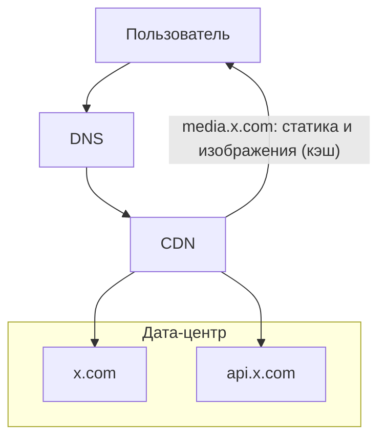
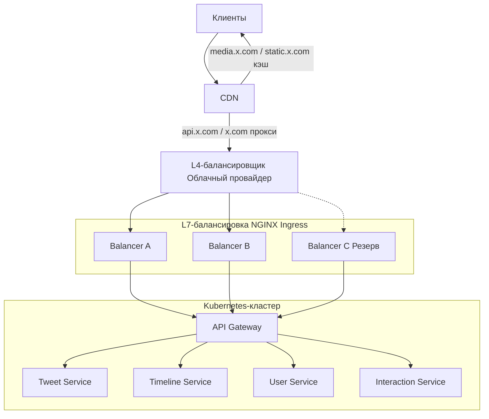
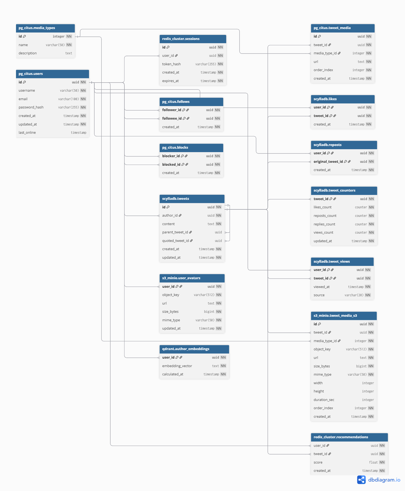
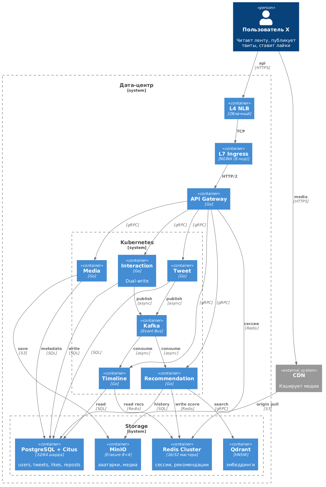

X (Twitter)
---
X (бывший Twitter) - социальная сеть для публичного обмена короткими сообщениями в реальном времени через специализированную ленту рекомендаций. Пользователи публикуют и взаимодействуют с сообщениями (твитами).

MVP

1. Лента твитов (постов) пользователей (лента "Для вас", без подписок)
2. Публикация твитов (постов), ответы/репосты/лайки/подписки/рекомендации

Статистика далее взята из источника [1]

#### Демография пользователей

| Категория   | Доля (2025) |
| :---------- | :---------- |
| Мужчины | 63,7%       |
| Женщины | 36,3%       |
#### Распределение по возрасту

| Возрастная группа | Доля мужчин | Доля женщин | Общая доля |
| :---------------- | :---------- | :---------- | :--------- |
| 13–17             | 1,0%        | 1,0%        | 2,0%       |
| 18–24             | 18,9%       | 13,2%       | 32,1%      |
| **25–34**         | **24,5%**   | **13,0%**   | **37,5%**  |
| 35–49             | 14,2%       | 6,9%        | 21,1%      |
| 50+               | 4,8%        | 2,5%        | 7,3%       |

#### Количество пользователей по странам

| **Страна**        | **Количество пользователей X (в миллионах)** |
| ----------------- | -------------------------------------------- |
| США               | 104                                          |
| Япония            | 70.9                                         |
| Индонезия         | 25.2                                         |
| Индия             | 24.1                                         |
| Великобритания    | 22.9                                         |
| Германия          | 21.6                                         |
| Турция            | 19.7                                         |
| Мексика           | 16.9                                         |
| Бразилия          | 16                                           |
| Саудовская Аравия | 15.7                                         |

#### Распределение трафика по странам

| **Ранг** | **Страна** | **Доля трафика** |
| -------- | ---------- | ---------------- |
| 1        | США        | 22.69%           |
| 2        | Япония     | 13.83%           |
| 3        | Бразилия   | 5.04%            |
| 4        | Турция     | 4.32%            |
| 5        | Индия      | 4.07%            |

#### Причины использования платформы

| Причина                         | Доля пользователей |
| :------------------------------ | :----------------- |
| Чтение новостей                 | 59%                |
| Слежение за брендами/компаниями | 38,1%              |
| Развлекательный контент         | 35,7%              |
| Публикация фото и видео         | 28,3%              |
| Общение с друзьями и семьей     | 19,4%              |

#### Продуктовые метрики

Источник [3](https://dataresearchtools.com/twitter-x-active-users-statistics-2026/)

| Показатель                                                        | Значение               | Комментарий                                       |
| :---------------------------------------------------------------- | :--------------------- | :------------------------------------------------ |
| MAU                                                               | 620 млн                |                                                   |
| Ежедневная аудитория (DAU)                                        | 248 млн пользователей  |                                                   |
| Доля авторов                                                      | 10% от DAU             |                                                   |
| Количество авторов                                                | 24,8 млн пользователей | 248 млн × 0,10 (публикует контент 10% от DAU) [2] |
| Среднее количество твитов в день                                  | 465 млн                |                                                   |
| Твитов на одного автора в день                                    | ~ 18,75                | 465 млн / 24,8 млн                                |
| Твитов на пользователя в день                                     | ~ 1,87                 | 465 млн / 248 млн                                 |
| Среднее количество ретвитов в день                                | 320 млн                |                                                   |
| Ретвитов на пользователя в день                                   | ~ 1,29                 | 320 млн / 248 млн                                 |
| Среднее количество лайков за день                                 | 2,8 млрд               |                                                   |
| Лайков на пользователя в день                                     | ~ 11,29                | 2,8 млрд / 248 млн                                |
| Средняя продолжительность сеанса                                  | 6 минут 42 секунды     |                                                   |
| Количество сеансов в день (в среднем на одного пользователя)      | 4,5                    |                                                   |
| Общее время в день на пользователя                                | ~ 30 минут 9 секунд    |                                                   |
| Среднее количество просмотров ленты в день на одного пользователя | 150                    |                                                   |
| Количество просмотров видео в день                                | 8,5 млрд               |                                                   |
| Просмотров видео на пользователя в день                           | ~ 34,27                | 8,5 млрд / 248 млн                                |
#### Список источников

1. [twitter-statistics](https://www.demandsage.com/twitter-statistics/)
2. [Статистика X (Twitter) 2026: информация о пользователях для маркетологов](https://affmaven.com/ru/x-twitter-statistics/#:~:text=Если%2010%25%20пользователей%20создают%20большую%20часть%20контента%2C%20что%20делают%20остальные%2090%25%3F%20Большинство%20пользователей%20X%20—%20«зрители»%2C%20которые%20в%20основном%20потребляют%20контент%2C%20а%20не%20создают%20его.)
3. [Twitter/X Active Users Statistics 2026: Complete Data Report](https://dataresearchtools.com/twitter-x-active-users-statistics-2026/) 

---

# 2. Расчёт нагрузки

Относительно документации API Twitter (X) [1](https://docs.x.com/x-api/fundamentals/data-dictionary#content-area), объект Post (твит) содержит следующие поля

| Поле                             | Размер                |
| -------------------------------- | --------------------- |
| `id` (20 цифр)                   | 20 байт               |
| `text` (280 символов)            | ~280-560 байт (UTF-8) |
| `edit_history_tweet_ids` массив  | ~50 байт              |
| `author_id` (19 цифр)            | 19 байт               |
| `created_at` (24 символа)        | 24 байта              |
| `conversation_id` (19 цифр)      | 19 байт               |
| `public_metrics` (6 полей)       | ~120 байт             |
| `lang` (2-5 символов)            | ~10 байт              |
| `reply_settings` (8-10 символов) | ~15 байт              |

Итого в среднем ~1КБ

Размеры для расчета следующие:

| Тип твита   | Размер  | Комментарий/Допущения                                                                                                                                                                                                                                      |
| ----------- | ------- | ---------------------------------------------------------------------------------------------------------------------------------------------------------------------------------------------------------------------------------------------------------- |
| Текст       | 1 КБ    | На основе расчета                                                                                                                                                                                                                                          |
| Изображение | 200 KB  | Средний размер после сжатия, взят на основе разбора сервиса по обмену фото [2](https://blog.csdn.net/gitblog_01063/article/details/150895451), примем как допущение                                                                                        |
| Видео       | 37,5 МБ | Размер обычного видео в формате 1080p с частотой 30 кадров в секунду и битрейтом 5 Мбит/с составляет около 37,5 МБ в минуту. [3](https://snxpstudio.co/resources/video-file-size-calculator/), примем как допущение, т.к. точной статистики из twitter нет |
| GIF         | 244 KB  | среднее значение gif, взято с сайта, который предоставляет медиа статистику [4](https://infinitejest.wallacewiki.com/david-foster-wallace/index.php?title=Special:MediaStatistics), примем как допущение                                                   |

Распределение постов следующее [5](https://pmc.ncbi.nlm.nih.gov/articles/PMC10995791/table/table1/)(в источнике проводилось исследование по распределение постов на тему продовольственной безопасности, но т.к. более подробных сведений нет, берём это как допущение):

| Тип             | Процент |
| --------------- | ------- |
| Только текст    | 90      |
| С изображением  | 9,8     |
| С видео         | 0,1     |
| С GIF-анимацией | 0,2     |

### Хранилище автора за месяц

| | Постов в день | Постов в месяц | Хранилище |
| :--- | :--- | :--- | :--- |
| **Текст** | 18.75 (твитов на автора в день) * 0.90 (доля текстовых постов) = 16.875 | 16.875 * 30 (дней в месяце) = 506.25 | 506.25 * 0.001 (размер текстового поста в МБ) = 0.506 МБ |
| **Изображения** | 18.75 (твитов на автора в день) * 0.098 (доля постов с изображением) = 1.8375 | 1.8375 * 30 (дней в месяце) = 55.125 | 55.125 * 0.195 (размер изображения в МБ) = 10.749 МБ |
| **Видео** | 18.75 (твитов на автора в день) * 0.001 (доля постов с видео) = 0.01875 | 0.01875 * 30 (дней в месяце) = 0.5625 | 0.5625 * 37.5 (размер видео в МБ) = 21.094 МБ |
| **GIF** | 18.75 (твитов на автора в день) * 0.002 (доля постов с GIF) = 0.0375 | 0.0375 * 30 (дней в месяце) = 1.125 | 1.125 * 0.238 (размер GIF в МБ) = 0.268 МБ |
| **Итого на автора в месяц** | | | 0.506 + 10.749 + 21.094 + 0.268 = 32.617 МБ |

**Хранилище всех авторов за месяц:** 32.617 МБ (на автора в месяц) * 24.8 млн (количество авторов) = 808.9 млн МБ = 0.81 ПБ

### Читатели

| Читатели (не публикующие)   | 248 млн (DAU) - 24.8 млн (авторы) = 223.2 млн                                           |
| :-------------------------- | :-------------------------------------------------------------------------------------- |
| Видеопросмотров на читателя | 8.5 млрд (просмотров видео в день) / 223.2 млн (читатели) = 38.1                        |
| Лайков на пользователя      | 2.8 млрд (лайков в день) / 248 млн (DAU) = 11.29                                        |
| Ретвитов на пользователя    | 320 млн (ретвитов в день) / 248 млн (DAU) = 1.29                                        |
| Взаимодействий на твит      | (2.8 млрд (лайки в день) + 0.32 млрд (ретвиты в день)) / 465 млн (твитов в день) = 6.71 |

### Сетевой трафик в день

| Отдача видео                                         | 8.5 млрд (просмотров видео в день) * 1.91 МБ (размер передаваемого видео [6](https://greenspector.com/en/the-battle-of-the-week-twitter-special-video-vs-image-vs-gif/)) = 16.24 ПБ |
| :--------------------------------------------------- | :---------------------------------------------------------------------------------------------------------------------------------------------------------------------------------- |
| **Отдача изображений (при 300 показах на читателя)** |                                                                                                                                                                                     |
| Показов на читателя                                  | 300 (показов ленты в день на читателя, допущение) * 0.098 (доля постов с изображением) = 29.4                                                                                       |
| Всего показов                                        | 223.2 млн (читатели) * 29.4 (показов на читателя) = 6.56 млрд                                                                                                                       |
| Трафик                                               | 6.56 млрд (всего показов) * 0.195 МБ (размер изображения в МБ) = 1.28 ПБ                                                                                                            |
| **Трафик загрузки (upload)**                         |                                                                                                                                                                                     |
| Видео                                                | `24.8 млн (авторы) * 0.01875 (видео-постов на автора в день) * 37.5 (размер видео в МБ) = 17.44 млн МБ`                                                                             |
| Изображения                                          | `24.8 млн (авторы) * 1.8375 (постов с изображением на автора в день) * 0.195 (размер изображения в МБ) = 8.88 млн МБ`                                                               |
| Текст                                                | `24.8 млн (авторы) * 16.875 (текстовых постов на автора в день) * 0.001 (размер текстового поста в МБ) = 0.418 млн МБ`                                                              |
| GIF                                                  | `24.8 млн (авторы) * 0.0375 (GIF-постов на автора в день) * 0.238 (размер GIF в МБ) = 0.221 млн МБ`                                                                                 |
| Итого                                                | 26.96 млн МБ = 26.96 ТБ                                                                                                                                                             |

### Пиковая нагрузка

| Суточная отдача (видео + изображения) | 16.24 ПБ (отдача видео) + 1.28 ПБ (отдача изображений) = 17.52 ПБ               |
| :------------------------------------ | :------------------------------------------------------------------------------ |
| Пиковая нагрузка (25% от суточной)    | 17.52 ПБ (суточная отдача) * 0.25 = 4.38 ПБ                                     |
| Пиковая скорость                      | 4.38 ПБ (пиковая нагрузка) / 3600 (секунд в часе) = 1.22 ПБ/с = 9.76 Тбит/с     |
| Средняя скорость                      | 17.52 ПБ (суточная отдача) / 86400 (секунд в сутках) = 0.203 ПБ/с = 1.62 Тбит/с |

### RPS

Исходя из данных почасовой активности [7](https://popsters.ru/research/Popsters_Research_2023_rus.pdf)
- Сумма всех значений = 100%
- Среднее значение в час = 100% / 24 = 4.167%
- Максимальное значение = 5.6% (в 17:00)
- Коэффициент = Пик / Среднее = 5.6 / 4.167 = 1.344
Округлим до 1.5 с "запасом"

| Тип                   | Средний                                                                | Пиковый (x1.5) |
| :-------------------- | :--------------------------------------------------------------------- | :------------- |
| **Публикация твитов** | 465 млн (твитов в день) / 86400 (секунд в сутках) = 5 382              | 8 073          |
| **Лайки**             | 2 800 млн (лайков в день) / 86400 (секунд в сутках) = 32 407           | 48 610         |
| **Ретвиты**           | 320 млн (ретвитов в день) / 86400 (секунд в сутках) = 3 704            | 5 556          |
| **Просмотр видео**    | 8 500 млн (просмотров видео в день) / 86400 (секунд в сутках) = 98 380 | 147 570        |
| Итого                 | 139 873                                                                | 209 809        |
#### Список источников

1. [x-api](https://docs.x.com/x-api/fundamentals/data-dictionary#content-area)
2. [Video File Size Calculator - SNXP Studio](https://blog.csdn.net/gitblog_01063/article/details/150895451)
3. [Video File Size Calculator](https://snxpstudio.co/resources/video-file-size-calculator/)
4. [Media statistics](https://infinitejest.wallacewiki.com/david-foster-wallace/index.php?title=Special:MediaStatistics)
5. [tweet descriptive data](https://pmc.ncbi.nlm.nih.gov/articles/PMC10995791/table/table1/)
6. [The battle of the week Twitter special: video vs image vs gif - Greenspector](https://greenspector.com/en/the-battle-of-the-week-twitter-special-video-vs-image-vs-gif/)
7. [Активность аудитории социальных сетей](https://popsters.ru/research/Popsters_Research_2023_rus.pdf)

---

# 3. Глобальная балансировка нагрузки

#### Функциональное разбиение по доменам

Три функциональных домена:

|Контур|Домен|Назначение|
|---|---|---|
|Web|x.com|Веб-клиент, одностраничное приложение|
|API|api.x.com|Основное API: лента, твиты, лайки, ретвиты, профиль|
|Media|media.x.com|Статические ресурсы: изображения и видео через CDN|
#### Расположение дата-центра

Для MVP выбирается один дата-центр в восточной части США (Северная Вирджиния).

Причины выбора:

1. Размещение дата-центра в США обеспечивает минимальную задержку для самой большой группы пользователей. [1](https://worldpopulationreview.com/country-rankings/twitter-users-by-country)
2. Выше плотность населения, тем больше пользователей, а значит, и нагрузка (RPS) в этом регионе [2](https://ru.wikipedia.org/wiki/Список_штатов_и_территорий_США_по_плотности_населения)
3. Находится рядом с крупнейшими магистральными сетями связи [3](https://personalpages.manchester.ac.uk/staff/m.dodge/cybergeography/Atlas/more_isp_maps.html)

#### Распределение запросов по дата-центрам

Используется один дата-центр, поэтому:

- весь API и Web трафик обрабатывается в нём
- медиа-трафик обслуживается CDN

Таким образом, в дата-центр поступает только API и Web нагрузка, а основная часть трафика (медиа) отсекается на уровне CDN.

#### Схема DNS балансировки

CDN выполняет:

- кэширование изображений и видео
- доставку контента с минимальной задержкой
- снижение нагрузки на дата-центр
- уменьшение исходящего трафика

Для `media.x.com` большинство запросов обрабатывается на уровне CDN без обращения в дата-центр.

#### Схема Anycast балансировки

Anycast не используется. Эта технология предполагает объявление одного IP-адреса из нескольких дата-центров одновременно, но при наличии только одного дата-центра она не даёт выигрыша и только усложняет эксплуатацию.

#### Механизм регулировки трафика между дата-центрами

Механизмы регулировки трафика между дата-центрами отсутствуют, поскольку дата-центр всего один. Весь внешний трафик направляется в Северную Вирджинию.

#### Список источников

1. [Twitter/X Users by Country 2026](https://worldpopulationreview.com/country-rankings/twitter-users-by-country)
2. [Список штатов и территорий США по плотности населения — Википедия](https://ru.wikipedia.org/wiki/Список_штатов_и_территорий_США_по_плотности_населения)
3. [An Atlas of Cyberspaces- ISP Backbone Maps](https://personalpages.manchester.ac.uk/staff/m.dodge/cybergeography/Atlas/more_isp_maps.html)

---

# 4. Локальная балансировка нагрузки

### Механизм резервирования

Для пула L7-балансировщиков (NGINX Ingress Controller) используется схема N + 1:

- N - минимальное количество балансировщиков, необходимое для обработки пиковой нагрузки.
- +1 - резервный экземпляр для обеспечения отказоустойчивости.

Такой подход обеспечивает:
1. Бесперебойную работу при отказе одного балансировщика.
2. Возможность проведения планового обслуживания без остановки сервиса.

Для L4-балансировки на входе (которая распределяет трафик между L7-балансировщиками) используется управляемый балансировщик облачного провайдера с гарантированной высокой доступностью.

### Схема балансировки нагрузки

Внутри дата-центра балансировка выполняется в два слоя:

1. L4 слой (внешний): Управляемый облачный балансировщик. Он принимает трафик от CDN (после проксирования API/Web запросов) и распределяет TCP-соединения между пулом L7-балансировщиков.
2. L7 слой (внутренний): Пул NGINX Ingress Controller. Выполняют:
   - TLS Termination - расшифровка HTTPS трафика.
   - Маршрутизацию по доменным именам (x.com, api.x.com).
   - Балансировку запросов между бэкенд-сервисами.
   - Rate limiting на уровне запросов.

Статический и медиа-трафик (media.x.com, static.x.com) полностью обслуживаются CDN и не доходят до L7-балансировщиков в дата-центре.

### Расчет количества L7-балансировщиков

#### Исходные данные

| Параметр                                       | Значение                        |
| ---------------------------------------------- | ------------------------------- |
| Пиковый RPS API (суммарный)                    | 209 809                         |
| Доля новых TLS-соединений                      | 20%                             |
| Пиковый CPS (TLS handshakes)                   | 209 809 * 0.20 = 41 962         |
| Производительность NGINX (TLS handshakes)      | 10 274 handshakes/с на 24 vCPU  |
| Производительность на 1 vCPU                   | 10 274 / 24 = 428 handshakes/с  |
| Пиковая пропускная способность сети (через L7) | не более 5% от 9.76 Тбит/с      |
| Реальная пиковая нагрузка на L7 (сеть)         | 9.76 Тбит/с * 0.05 = 488 Гбит/с |
| Пропускная способность NGINX                   | 8.80 Гбит/с на 24 vCPU          |
| Пропускная способность на 1 vCPU               | 8.80 / 24 = 0.367 Гбит/с        |

#### Расчет по лимиту TLS Handshakes

Требуемое количество vCPU для обработки пиковых рукопожатий:

vCPU_required = ceil(CPS_peak / handshakes_per_vCPU) = ceil(41 962 / 428) = ceil(98.0) = 98 vCPU

Выбираем профиль виртуальной машины для L7-балансировщика: 16 vCPU (стандартный размер для высоконагруженного ingress).

Количество рабочих нод L7 (без резерва):

N_work_ssl = ceil(98 / 16) = ceil(6.125) = 7

#### Проверка по пропускной способности сети

Пропускная способность одного балансировщика (16 vCPU):

throughput_per_node = 0.367 Гбит/с * 16 = 5.87 Гбит/с

Количество нод, необходимых для пикового трафика 488 Гбит/с:

N_net = ceil(488 / 5.87) = ceil(83.1) = 84

Сеть не является ограничителем, потому что:
- Реальный API-трафик (текст + метаданные) значительно меньше 488 Гбит/с.
- 95% трафика (медиа) отсекается на уровне CDN.
- По факту через L7 проходит менее 1% от 9.76 Тбит/с.
- Ограничителем остаётся TLS handshake (CPU).

#### Итоговое количество

| Назначение | N_work | Схема резервирования | N_total | vCPU на ноду | Итого vCPU |
|---|---|---|---|---|---|
| API + Web (api.x.com, x.com) | 7 | N + 1 | 8 | 16 | 128 |

Итоговое количество L7-балансировщиков: 8 нод (7 рабочих + 1 резервная).

### Межсервисная балансировка (Kubernetes)

Внутри Kubernetes-кластера используется стандартная балансировка через Kubernetes Services в режиме ClusterIP:

| Тип взаимодействия | Механизм | Метод балансировки |
|---|---|---|
| Ingress -> Backend Service | NGINX Ingress Controller | L7 HTTP, Round Robin |
| Service -> Pods | kube-proxy (IPVS режим) | L4, Round Robin |
| Разрешение имён сервисов | CoreDNS (внутренний DNS K8s) | - |

### Обеспечение отказоустойчивости

| Уровень | Отказ | Механизм | RTO |
|---|---|---|---|
| L4 (облачный) | Падение L4 балансировщика | HA облачного провайдера | менее 1 мин |
| L7 (NGINX) | Падение одной ноды (из 8) | Оставшиеся 7 нод принимают трафик | менее 30 сек |
| L7 (масштаб) | Отказ нескольких нод | Схема N+1 гарантирует запас | немедленно |
| Backend сервисы | Падение пода | Kubernetes readiness/liveness probes | менее 10 сек |

#### Список источников

1. [Testing the Performance of NGINX Ingress Controller for Kubernetes – NGINX Community Blog](https://blog.nginx.org/blog/testing-performance-nginx-ingress-controller-kubernetes)
2. [Testing the Performance of NGINX and NGINX Plus Web Servers – NGINX Community Blog](https://blog.nginx.org/blog/testing-the-performance-of-nginx-and-nginx-plus-web-servers)

---

### 5. Логическая схема БД

#### Логическая схема

#### Описание таблиц

| Таблица             | Назначение                        | Что хранится                                                                                                                     | Особенности                                                                                                |
| ------------------- | --------------------------------- | -------------------------------------------------------------------------------------------------------------------------------- | ---------------------------------------------------------------------------------------------------------- |
| `media_types`       | Справочник типов медиафайлов.     | Типы `image`, `video`, `gif`.                                                                                                    | Используется для категоризации медиавложений.                                                              |
| `users`             | Профиль пользователя.             | Идентификатор пользователя, username, email, хеш пароля, даты создания и обновления, время последнего онлайна.                   | Основная учетная сущность платформы. Username и email уникальны.                                           |
| `sessions`          | Активные пользовательские сессии. | Токен сессии (хеш), привязка к пользователю, даты создания и истечения.                                                          | Один пользователь может иметь несколько активных сессий.                                                   |
| `tweets`            | Твиты, ответы и цитаты.           | Автор, текст (1-280 символов), ссылка на родительский твит (для ответов), ссылка на цитируемый твит, даты создания и обновления. | Единая таблица для всех типов постов. Поддерживает вложенные ответы и цитаты.                              |
| `follows`           | Подписки пользователей.           | Кто подписался (follower), на кого подписался (followee), дата подписки.                                                         | Обеспечивает ленту "Подписки".                                                                             |
| `blocks`            | Заблокированные пользователи.     | Кто заблокировал (blocker), кого заблокировал (blocked), дата блокировки.                                                        | Исключает контент заблокированных пользователей из лент.                                                   |
| `likes`             | Лайки на твитах.                  | Пользователь, твит, дата лайка.                                                                                                  | Составной первичный ключ (user_id, tweet_id) без суррогатного id.                                          |
| `reposts`           | Ретвиты (репосты).                | Пользователь, оригинальный твит, дата ретвита.                                                                                   | Составной первичный ключ (user_id, original_tweet_id).                                                     |
| `tweet_views`       | Отслеживание показов твитов.      | Пользователь, твит, время показа, источник показа.                                                                               | **Составной PK (user_id, tweet_id). Используется для фильтрации уже показанных твитов в ленте "Для вас".** |
| `user_avatars`      | Аватары пользователей.            | Ключ объекта в S3, URL, размер, MIME-тип, дата обновления.                                                                       | Отделена от users для оптимизации запросов. Бинарные файлы в S3.                                           |
| `tweet_media`       | Метаданные медиафайлов твитов.    | Твит, тип медиа, URL, порядковый индекс, дата создания.                                                                          | Метаданные колоцированы с tweets для быстрого доступа.                                                     |
| `tweet_media`       | Медиафайлы твитов.                | Ключ объекта, URL, размер, MIME-тип, ширина, высота, длительность (для видео).                                                   | Бинарные файлы в S3 + CDN.                                                                                 |
| `recommendations`   | Рекомендованные твиты.            | Пользователь, твит, score (0-1), дата создания.                                                                                  | Redis Sorted Set. Score отражает релевантность.                                                            |
| `author_embeddings` | Эмбеддинги пользователей.         | Векторное представление (384-dim), дата расчета.                                                                                 | Qdrant для поиска похожих авторов.                                                                         |
| `tweet_counters`    | Денормализованные счетчики.       | Счетчики лайков, ретвитов, ответов, просмотров, дата обновления.                                                                 | Колоцирована с tweets, обновляется триггерами.                                                             |

#### Размеры данных и нагрузки на чтение с записью (обновленные)

| Таблица             | Средний размер строки | Запись, QPS avg / peak | Чтение, QPS avg / peak | Суточный поток записи, ГБ/сут | Суточный поток чтения, ГБ/сут | Основание                                                       |
| ------------------- | --------------------- | ---------------------- | ---------------------- | ----------------------------- | ----------------------------- | --------------------------------------------------------------- |
| `media_types`       | ~100 B                | <1 / <1                | ~10 / ~20              | <0.01                         | <0.01                         | Справочник практически статичен.                                |
| `users`             | ~200 B                | 5 / 10                 | 500,000 / 750,000      | 0.09                          | 9,000                         | Регистрации редки, чтение профилей при каждом запросе ленты.    |
| `sessions`          | ~150 B                | 50 / 75                | 248,000 / 372,000      | 0.65                          | 4,000                         | Каждая сессия создается при входе, читается при каждом запросе. |
| `tweets`            | ~500 B                | 5,382 / 8,073          | 940,000 / 1,410,000    | 240                           | 48,000                        | Основная нагрузка записи — создание твитов.                     |
| `follows`           | ~50 B                 | 300 / 500              | 200,000 / 300,000      | 1.3                           | 1,100                         | Подписки/отписки относительно редки.                            |
| `blocks`            | ~50 B                 | 10 / 20                | 248,000 / 372,000      | 0.04                          | 1,300                         | Блокировки редки.                                               |
| `likes`             | ~50 B                 | 32,407 / 48,610        | 500,000 / 750,000      | 140                           | 2,600                         | Высокая интенсивность лайков.                                   |
| `reposts`           | ~50 B                 | 3,704 / 5,556          | 100,000 / 150,000      | 16                            | 500                           | Ретвиты менее часты, чем лайки.                                 |
| **`tweet_views`**   | ~60 B                 | 248,000 / 372,000      | 940,000 / 1,410,000    | 1,300                         | 4,900                         | Каждый показ твита записывается.                                |
| `user_avatars`      | ~200 B                | 30 / 50                | 500,000 / 750,000      | 0.05                          | 7,200                         | Обновление аватаров редко.                                      |
| `tweet_media`       | ~200 B                | 10,000 / 15,000        | 200,000 / 300,000      | 170                           | 3,200                         | Медиа прикрепляются к ~60% твитов.                              |
| `recommendations`   | ~80 B                 | 500,000 / 750,000      | 940,000 / 1,410,000    | 3,500                         | 6,500                         | Регулярный пересчет рекомендаций для активных пользователей.    |
| `author_embeddings` | ~2 KB                 | 500 / 1,000            | 50,000 / 75,000        | 85                            | 9,000                         | Пересчет эмбеддингов при изменении интересов.                   |
| `tweet_counters`    | ~70 B                 | 41,500 / 62,000        | 940,000 / 1,410,000    | 200                           | 4,700                         | Обновляется каждым лайком/ретвитом/ответом/просмотром.          |

#### Требования к консистентности (обновленные)

| Таблица или связка                                        | Тип консистентности | Что должно быть согласовано                              | Основание                                                                                        |
| --------------------------------------------------------- | ------------------- | -------------------------------------------------------- | ------------------------------------------------------------------------------------------------ |
| `tweets` + `tweet_counters`                               | Strong.             | Создание твита и инициализация счетчика (0).             | Нельзя показывать NULL счетчики для нового твита.                                                |
| `likes` + `tweet_counters.likes_count`                    | Strong.             | Запись лайка и увеличение счетчика лайков.               | Пользователь должен мгновенно видеть свой лайк.                                                  |
| `reposts` + `tweet_counters.reposts_count`                | Strong.             | Запись ретвита и увеличение счетчика ретвитов.           | Атомарное обновление при ретвите.                                                                |
| `tweets.parent_tweet_id` + `tweet_counters.replies_count` | Strong.             | Создание ответа и увеличение счетчика ответов.           | Счетчик ответов должен быть точен.                                                               |
| **`tweet_views` + `recommendations`**                     | Eventual.           | Фильтрация уже показанных твитов при формировании ленты. | Допустима задержка в несколько секунд, но пользователь не должен видеть один твит дважды подряд. |
| `follows` при построении ленты                            | Strong.             | Актуальный список подписок для ленты.                    | Нельзя показывать твиты отписавшегося пользователя.                                              |
| `blocks` при построении лент                              | Strong.             | Исключение контента заблокированных пользователей.       | Заблокированный пользователь не должен появляться в лентах.                                      |
| `recommendations`                                         | Eventual.           | Обновление рекомендаций на основе нового поведения.      | Рекомендации могут обновляться с задержкой в минуты.                                             |
| `author_embeddings`                                       | Eventual.           | Обновление векторных представлений пользователей.        | Допустима задержка до нескольких часов.                                                          |
| `user_presence` (last_online)                             | Eventual.           | Обновление времени последней активности.                 | Небольшая задержка (5-10 секунд) допустима.                                                      |

#### Особенности распределения нагрузки по ключам (обновленные)

| Таблица | Основной ключ нагрузки | Характер распределения | Горячие ключи |
| ------- | ---------------------- | ---------------------- | -------------- |
| `media_types` | `id` | Равномерное. | Справочник слишком мал. |
| `users` | `id`, `username`, `email` | Равномерное. | Популярные пользователи (знаменитости) создают пики чтения. |
| `sessions` | `user_id`, `token_hash` | User-centric. | Пользователи с несколькими устройствами создают больше сессий. |
| `tweets` | `id`, `author_id` | Смешанное. | Популярные авторы создают нагрузку записи, вирусные твиты — чтения. |
| `follows` | `(follower_id)`, `(followee_id)` | Followee-centric. | Популярные пользователи имеют миллионы подписчиков. |
| `blocks` | `(blocker_id, blocked_id)` | Равномерное. | Блокировки распределены равномерно. |
| `likes` | `(tweet_id)`, `(user_id)` | Tweet-centric. | Вирусные твиты концентрируют миллионы лайков. |
| `reposts` | `(original_tweet_id)` | Tweet-centric. | Популярные твиты получают сотни тысяч ретвитов. |
| **`tweet_views`** | **`(user_id, tweet_id)`** | **User-centric.** | **Активные пользователи генерируют основной объем записей просмотров.** |
| `user_avatars` | `user_id` | User-centric. | Нагрузка пропорциональна активности пользователя. |
| `tweet_media` | `tweet_id` | Tweet-centric. | Только часть твитов содержит медиа. |
| `recommendations` | `(user_id, score)` | User-centric. | Активные пользователи требуют частого пересчета рекомендаций. |
| `author_embeddings` | `user_id` | Равномерное. | Пересчет для всех активных пользователей. |
| `tweet_counters` | `tweet_id` | Tweet-centric. | Вирусные твиты создают основной трафик обновлений счетчиков. |

---

# 6. Физическая схема баз данных

#### Физические проекции данных

Для X (Twitter) данные разделены на две физические проекции:

| Проекция          | Ключ физического доступа | Какие сценарии обслуживает                          | Основная идея                         |
| ----------------- | ------------------------ | --------------------------------------------------- | ------------------------------------- |
| **Tweet-centric** | `tweet_id`               | Выдача твитов, лайки/ретвиты, счётчики, медиа, просмотры | Все данные одного твита лежат рядом   |
| **User-centric**  | `user_id`                | Профиль, подписки, блокировки, сессии, рекомендации | Все данные пользователя в одном месте |

#### Физическая схема

(СУДБ в названии таблиц)

#### Выбор СУБД по таблицам

| Таблица             | СУБД               | Ключ шардирования / расположение                     | Резервирование         |
| ------------------- | ------------------ | ---------------------------------------------------- | ---------------------- |
| `media_types`       | PostgreSQL (Citus) | Reference table                                      | RF = 2                 |
| `users`             | PostgreSQL (Citus) | `HASH(user_id)`, 32 шарда                            | 1 primary + 2 replicas |
| `sessions`          | Redis Cluster      | `KEY = session:{id}`, автоматическое по CRC16        | 1 master + 1 replica   |
| `follows`           | PostgreSQL (Citus) | `HASH(follower_id)`, 32 шарда                        | 1 primary + 2 replicas |
| `blocks`            | PostgreSQL (Citus) | `HASH(blocker_id)`, 32 шарда                         | 1 primary + 2 replicas |
| `tweets`            | ScyllaDB           | `PARTITION BY (id)`, 64 шарда                        | RF = 3                 |
| `tweet_views`       | ScyllaDB           | `PARTITION BY (user_id)`, 32 шарда                   | RF = 3                 |
| `tweet_media`       | PostgreSQL (Citus) | `HASH(tweet_id)`, колоцирована с `tweets`            | 1 primary + 2 replicas |
| `tweet_media_s3`    | S3 (MinIO) + CDN   | Object key = {tweet_id}/{media_id}                   | Erasure coding 8+4     |
| `likes`             | ScyllaDB           | `PARTITION BY (tweet_id)`, 64 шарда                  | RF = 3                 |
| `reposts`           | ScyllaDB           | `PARTITION BY (original_tweet_id)`, 64 шарда         | RF = 3                 |
| `tweet_counters`    | ScyllaDB           | `PARTITION BY (tweet_id)`, колоцирована с `tweets`   | RF = 3                 |
| `user_avatars`      | S3 (MinIO) + CDN   | Object key = `avatars/{user_id}`                     | Erasure coding 8+4     |
| `recommendations`   | Redis Cluster      | `KEY = recommendations:{user_id}`, Sorted Set        | 1 master + 1 replica   |
| `author_embeddings` | Qdrant             | Collection `author_embeddings`, шардинг по `user_id` | 1 primary + 2 replicas |

##### Обоснование выбора СУБД

| Хранилище          | Назначение                                                             | Причины                                                                    |
| ------------------ | ------------------------------------------------------------------ | -------------------------------------------------------------------------- |
| ScyllaDB       | Tweet-centric таблицы (твиты, лайки, репосты, просмотры, счетчики) | Высокая производительность на запись                                       |
| PostgreSQL + Citus | Пользователи, подписки, блокировки, медиа-метаданные                   | Требуются связи между таблицами и транзакции. Citus добавляет шардирование |
| Redis              | Сессии, кэш лент, рекомендации                                         | Memcached - не сохраняет данные на диск, нет сортированных списков         |
| Qdrant             | Вектора пользователей для рекомендаций                                 | pgvector (расширение PostgreSQL) - медленнее на миллионах векторов         |
| S3 (MinIO) + CDN   | медиа (аватары, изображения, видео)                                    | высокая эффективность хранения, CDN для глобальной доставки                |

#### Индексы

| Таблица                 | Индекс                           | Поля                                   | Тип               |
| ----------------------- | -------------------------------- | -------------------------------------- | ----------------- |
| `users_postgres`        | `idx_users_username`             | `username`                             | UNIQUE            |
| `users_postgres`        | `idx_users_email`                | `email`                                | UNIQUE            |
| `users_postgres`        | `idx_users_last_online`          | `last_online DESC`                     | INDEX             |
| `tweets_scylladb`       | `idx_tweets_author_created`      | `(author_id, created_at DESC)`         | MATERIALIZED VIEW |
| `follows_postgres`      | `idx_follows_followee_created`   | `(followee_id, created_at DESC)`       | INDEX             |
| `follows_postgres`      | `idx_follows_unique`             | `(follower_id, followee_id)`           | UNIQUE            |
| `blocks_postgres`       | `idx_blocks_unique`              | `(blocker_id, blocked_id)`             | UNIQUE            |
| `likes_scylladb`        | `idx_likes_tweet_created`        | `(tweet_id, created_at DESC)`          | MATERIALIZED VIEW |
| `reposts_scylladb`      | `idx_reposts_original_created`   | `(original_tweet_id, created_at DESC)` | MATERIALIZED VIEW |
| `tweet_views_scylladb`  | `idx_tweet_views_tweet_created`  | `(tweet_id, viewed_at DESC)`           | MATERIALIZED VIEW |
| `tweet_media_postgres`  | `idx_tweet_media_order`          | `(tweet_id, order_index)`              | UNIQUE            |
| `recommendations_redis` | `idx_recommendations_user_score` | `(user_id, score DESC)`                | SORTED SET        |

#### Схема резервного копирования

| Компонент                         | Механизм                 | Расписание         | Retention  |
| --------------------------------- | ------------------------ | ------------------ | ---------- |
| ScyllaDB (tweet-centric)      | Snapshot + CommitLog | каждые 6 часов | 7 дней |
| PostgreSQL (user-centric)         | WAL + pg_basebackup      | каждые 6 часов     | 7 дней     |
| Redis (session + recommendations) | RDB + AOF                | RDB каждые 15 мин  | 7 дней     |
| Qdrant                            | Snapshot в S3            | ежечасный          | 7 дней     |
| S3                                | Versioning               | непрерывно         | 30 дней    |

---

# 7. Алгоритмы

Наиболее важные алгоритмы системы: формирование ленты рекомендаций, публикация и распространение твитов, обновление счетчиков действий, формирование ленты подписок.

### Основные проблемы

|Проблема|Описание|
|---|---|
|Новые пользователи|нет истории действий, непонятны интересы|
|Новые твиты|нет лайков и статистики|
|Очень популярные пользователи|создают слишком большую нагрузку при публикации|
|Быстрая работа системы|лента должна открываться почти мгновенно|

### Решение для новых пользователей

Чтобы сразу показать интересный контент: пользователь выбирает интересы (темы), загружаются популярные твиты по этим темам, формируется примерный профиль интересов пользователя, подбираются похожие твиты по смыслу, эти твиты показываются в ленте.

### Решение для новых твитов

Чтобы новый твит мог попасть в рекомендации: для твита строится смысловое описание (вектор), твит добавляется в систему поиска похожих твитов, если твит начинает быстро набирать популярность - он попадает в рекомендации.

### Публикация твита (распространение)

Пользователь публикует твит. Система получает событие о новом твите. Проверяется, сколько у автора подписчиков: если подписчиков мало - твит сразу отправляется в ленты подписчиков, если много - твит не рассылается сразу. При малом количестве подписчиков твит добавляется в ленту каждого подписчика. Если отправлять всем сразу - система перегрузится, поэтому используется смешанный подход.

### Формирование ленты "Для вас"

Собираются кандидаты: твиты от подписок, популярные твиты, похожие твиты по интересам. Убираются заблокированные пользователи и уже просмотренные твиты. Каждому твиту присваивается оценка: насколько он интересен пользователю, насколько он новый, насколько он популярен. Твиты сортируются по оценке. Лучшие сохраняются в быструю память.

### Обновление лайков и других действий

Пользователь ставит лайк, делает репост или отвечает. Событие отправляется в систему обработки. Счетчики увеличиваются в быстрой памяти. Время от времени данные записываются в базу данных. База данных не выдерживает миллионы обновлений, быстрая память работает быстрее, база используется для надежного хранения.

### Лента подписок

Берется список подписок пользователя. Берутся последние твиты каждого автора. Все твиты объединяются. Сортируются по времени (сначала новые). Показываются самые свежие. Алгоритм работает просто и быстро, не требует сложных моделей, хорошо кешируется.

### Итоговая система рекомендаций

Лента "Для вас" формируется из трех источников: твиты от подписок, популярные твиты, твиты, похожие по интересам. Все твиты объединяются, каждому дается оценка, выбираются лучшие.

---

# 8. Технологии

| Технология         | Область применения                                | Мотивационная часть                                                                                                                                                                                               |
| ------------------ | ------------------------------------------------- | ----------------------------------------------------------------------------------------------------------------------------------------------------------------------------------------------------------------- |
| Go                 | Бэкенд, API-сервисы                               | Высокая производительность и легковесные горутины для десятков тысяч параллельных запросов. Стандартная библиотека с HTTP-сервером ускоряет разработку. Компиляция в статический бинарник упрощает развертывание. |
| TypeScript + React | Веб-клиент                                        | TypeScript добавляет статическую типизацию для большого фронтенд-проекта. React обеспечивает компонентный подход и удобное управление состоянием ленты.                                                           |
| Kotlin             | Android-клиент                                    | Современный язык для Android от Google. Обеспечивает нативную работу с push-уведомлениями и фоновой синхронизацией.                                                                                               |
| Swift              | iOS-клиент                                        | Основной язык для экосистемы Apple. Обеспечивает высокую производительность и безопасность памяти.                                                                                                                |
| Nginx              | L7-балансировка, TLS termination, раздача статики | Высокопроизводительный reverse-proxy. Обрабатывает десятки тысяч соединений, поддерживает кэширование и сжатие.                                                                                                   |
| Apache Kafka       | Потоковая обработка событий                       | Центральная шина событий. При публикации твита сообщение отправляется в Kafka, откуда его забирают сервисы ленты, статистики и рекомендаций.                                                                      |
| PostgreSQL         | Хранение пользователей, твитов, подписок, лайков  | Реляционная СУБД с поддержкой целостности данных, сложных запросов и индексов. Поддерживает репликацию для разгрузки сервера.                                                                                     |
| Redis              | Кэш ленты, счетчики лайков, сессии пользователей  | In-memory хранилище с микросекундной задержкой. Sorted sets удобны для реализации ленты с сортировкой по времени.                                                                                                 |
| Kubernetes         | Оркестрация                                       | Масштабирование сервисов                                                                                                                                                                                          |
| CloudFront         | Доставка медиаконтента (изображения, видео, GIF)  | Единственный CDN с 410+ точками присутствия, обеспечивающий минимальную задержку. Родная интеграция с S3 упрощает инфраструктуру, а AWS Shield Advanced защищает от DDoS-атак без дополнительных затрат.          |

---

# 9. Обеспечение надёжности

#### Таблица резервирования

| Компонент | Способ резервирования | RTO / RPO |
| :--- | :--- | :--- |
| CDN | Кэширование контента, раздача из edge-узлов | 0 мин / 0 мин |
| L4 балансировщик | Обеспечивается облачным провайдером | < 1 мин / 0 мин |
| L7 балансировщик (NGINX) | N+1, 8 нод (7 рабочих + 1 резерв) | < 30 сек / 0 мин |
| ScyllaDB (твиты, лайки, репосты, просмотры, счетчики) | 64 шарда, RF=3, автоматическая репликация | < 5 мин / < 5 мин |
| PostgreSQL (пользователи, подписки, блокировки) | 32 шарда, репликация (RF=2), Patroni | < 5 мин / < 5 мин |
| Redis (сессии) | 16 мастеров + 16 реплик, Redis Sentinel | < 2 мин / 0 мин |
| Redis (рекомендации) | 32 мастера + 32 реплики | < 2 мин / < 15 мин |
| Qdrant (вектора) | 1 primary + 2 реплики | < 5 мин / < 1 час |
| Kafka | Replication Factor = 3 | < 5 мин / < 5 мин |
| Backend сервисы | Не менее 3 реплик каждого сервиса, HPA | < 10 сек / 0 мин |
| S3 (MinIO) | Erasure coding 8+4, versioning | < 10 мин / < 30 мин |
| K8s control plane | 5 мастер-нод, 3 зоны доступности | < 5 мин / 0 мин |

#### Отказ компонентов

| Компонент                    | Что происходит                                                                                          |
| :--------------------------- | :------------------------------------------------------------------------------------------------------ |
| L7 балансировщик (1 из 8)    | Остальные 7 продолжают работать, снижается запас пропускной способности                                 |
| ScyllaDB (один шард)         | Автоматическое переключение на реплику, недоступны только данные этого шарда (1/64), остальные работают |
| ScyllaDB (целый узел)        | RF=3, данные доступны из двух других реплик, Hinted Handoff при восстановлении                          |
| PostgreSQL (один шард)       | Недоступны только данные этого шарда, Patroni переключает на реплику                                    |
| Redis (рекомендации)         | Лента "Для вас" временно упрощается (только подписки + популярное)                                      |
| Qdrant                       | Векторные рекомендации отключаются, работает fallback на популярные твиты                               |
| Kafka                        | Публикация твитов может задержаться на 1-2 минуты, чтение лент работает                                 |
| S3 (хранилище медиа)         | Аватары и картинки берутся из кэша CDN (24 часа), текст твитов работает                                 |
| CDN                          | Медиа грузятся медленнее (напрямую из S3), но функциональность сохраняется                              |
| Backend сервис (один под)    | K8s перезапускает под за <10 секунд, другие реплики работают                                            |
| K8s (целая зона доступности) | Поды перераспределяются по живым зонам                                                                  |

---
# 10 Схема проекта

# 11. Список серверов

## Требования к ресурсам

| Сервис | Нагрузка | CPU | RAM | Диск | Сеть | Краткий расчёт |
|--------|----------|-----|-----|------|------|----------------|
| L7 Ingress (NGINX) | 41 962 TLS handshakes/с пик | 112 vCPU | 224 ГБ | 1.0 ТБ SSD | 10 Гбит/с | 98 vCPU треб. / 16 vCPU на ноду = 7 нод + 1 резерв |
| Backend API (Go) | 209 809 RPS пик | 200 vCPU | 400 ГБ | 2.0 ТБ SSD | 10 Гбит/с | ~2 000 RPS/vCPU, 100 vCPU треб., 10 нод × 20 vCPU |
| Kafka | 6 843 msg/s пик | 24 vCPU | 48 ГБ | 3.0 ТБ SSD | 5 Гбит/с | 3 брокера, RF=3, retention 3 дня |
| PostgreSQL user-cluster | 23 468 LPS чтение | 64 vCPU | 256 ГБ | 6.0 ТБ NVMe | 3 Гбит/с | 32 шарда, 1 primary + 2 replicas на 8 физических нод |
| PostgreSQL tweet-cluster | 310 450 LPS чтение | 256 vCPU | 1 024 ГБ | 24.0 ТБ NVMe | 10 Гбит/с | 64 шарда, 1 primary + 2 replicas на 16 физических нод |
| Redis session | 1 734 RPS | 32 vCPU | 64 ГБ | 1.0 ТБ SSD | 2 Гбит/с | 16 мастеров + 16 реплик |
| Redis recommendation | 161 500 RPS | 64 vCPU | 128 ГБ | 2.0 ТБ SSD | 3 Гбит/с | 32 мастера + 32 реплики |
| Qdrant | 50 000 поисков/с | 32 vCPU | 128 ГБ | 2.0 ТБ NVMe | 2 Гбит/с | 1 primary + 2 replicas |
| MinIO | 9.76 Тбит/с пик | 96 vCPU | 384 ГБ | 140 ТБ HDD | 40 Гбит/с | 12 нод, erasure coding 8+4 |
| **Итого** | - | **880 vCPU** | **2 656 ГБ** | **181 ТБ** | - | - |

## Серверы

| Сервис / пул | Тип | Конфигурация | Кол-во |
|--------------|-----|--------------|--------|
| L7 Ingress | Cloud VM | 16 vCPU / 32 ГБ / 200 ГБ SSD | 8 |
| Backend API | Cloud VM | 20 vCPU / 40 ГБ / 200 ГБ SSD | 10 |
| Kafka | Cloud VM | 8 vCPU / 16 ГБ / 1 ТБ SSD | 3 |
| PostgreSQL user-cluster | Bare Metal | 8 cores / 32 ГБ / 2×1 ТБ NVMe | 8 |
| PostgreSQL tweet-cluster | Bare Metal | 16 cores / 64 ГБ / 2×2 ТБ NVMe | 16 |
| Redis session | Cloud VM | 4 vCPU / 8 ГБ / 100 ГБ SSD | 32 |
| Redis recommendation | Cloud VM | 8 vCPU / 16 ГБ / 100 ГБ SSD | 64 |
| Qdrant | Bare Metal | 16 cores / 64 ГБ / 2×1 ТБ NVMe | 3 |
| MinIO | Bare Metal | 8 cores / 32 ГБ / 8×4 ТБ HDD | 12 |
| **Итого** | - | - | **156** |

## Kubernetes / контейнеры

| Сервис | Поды | CPU req / lim | RAM req / lim | Размещение |
|--------|------|---------------|---------------|-------------|
| ingress-nginx | 8 | 4 / 8 | 4 / 8 ГБ | L7 pool |
| api-gateway | 11 | 2 / 6 | 1 / 2 ГБ | backend pool |
| tweet-service | 20 | 2 / 4 | 2 / 4 ГБ | backend pool |
| interaction-service | 15 | 2 / 4 | 2 / 4 ГБ | backend pool |
| media-service | 5 | 1 / 2 | 1 / 2 ГБ | backend pool |
| timeline-service | 13 | 2 / 4 | 2 / 4 ГБ | backend pool |
| recommendation-service | 10 | 2 / 4 | 2 / 4 ГБ | backend pool |
| **Итого** | **82** | **170 / 356 vCPU** | **168 / 332 ГБ** | - |

## Суммарная аллокация по пулам Kubernetes

| Пул | Ноды | Ресурсы пула | Сумма requests | Сумма limits | Запас по requests |
|-----|------|--------------|----------------|--------------|-------------------|
| L7 pool | 8 | 128 vCPU / 256 ГБ RAM | 32 vCPU / 32 ГБ | 64 vCPU / 64 ГБ | 96 vCPU / 224 ГБ |
| Backend pool | 10 | 200 vCPU / 400 ГБ RAM | 138 vCPU / 136 ГБ | 292 vCPU / 268 ГБ | 62 vCPU / 264 ГБ |
| **Итого** | **18** | **328 vCPU / 656 ГБ RAM** | **170 vCPU / 168 ГБ** | **356 vCPU / 332 ГБ** | **158 vCPU / 488 ГБ** |