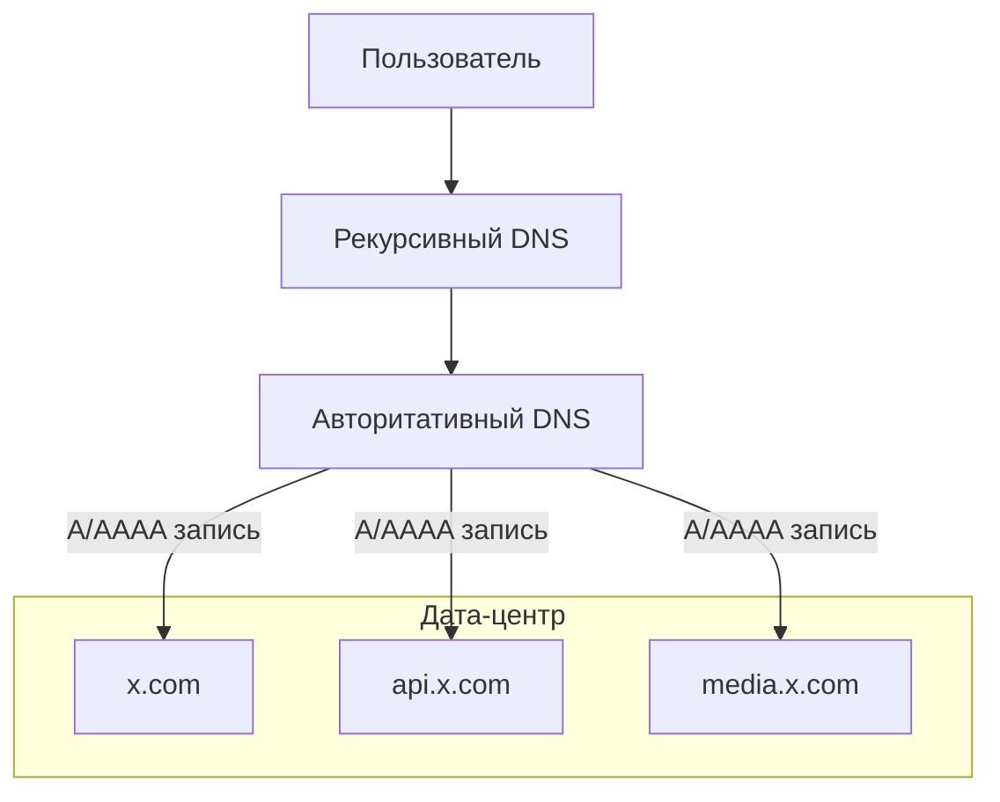
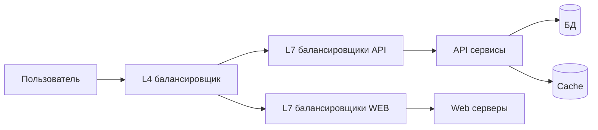
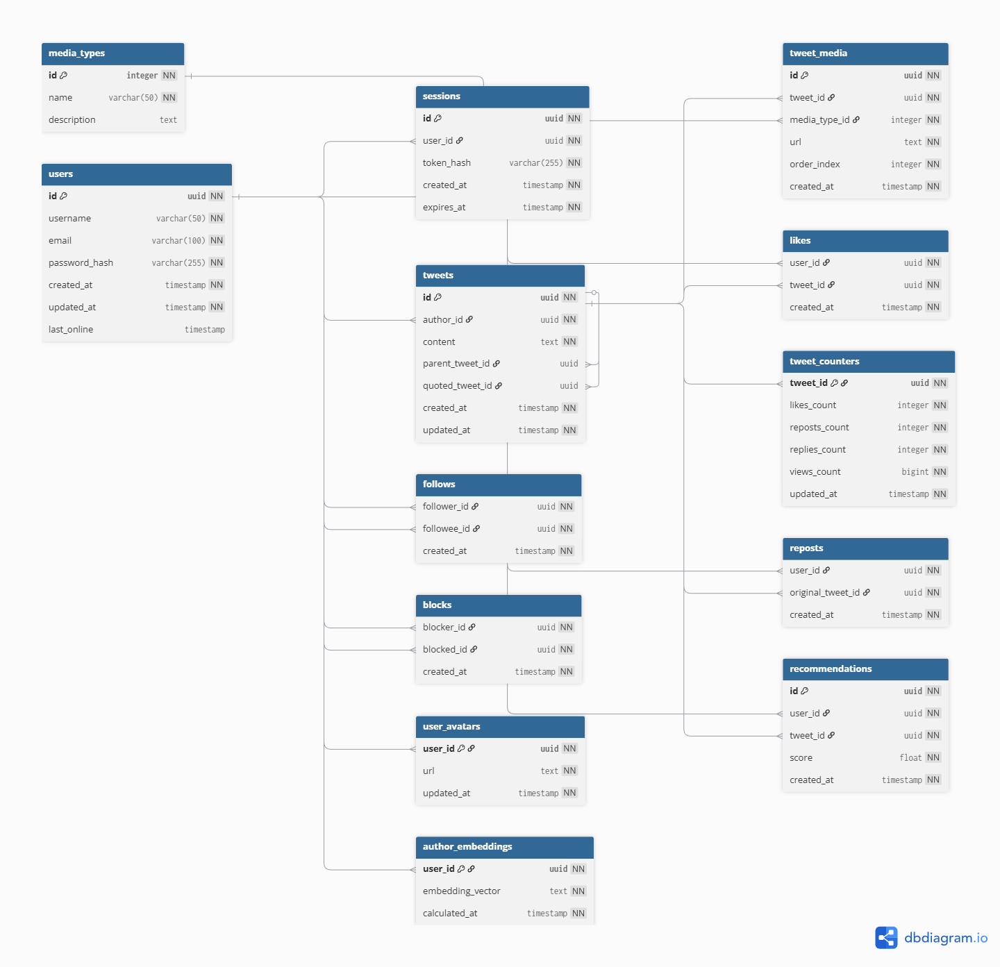
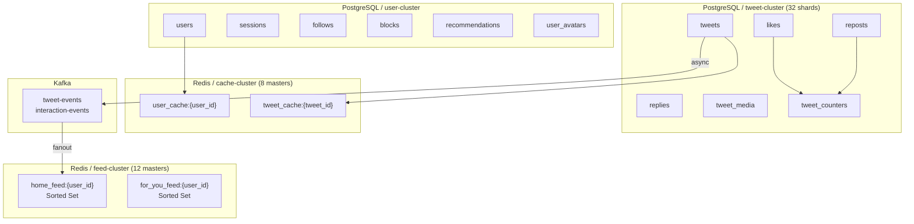

X (Twitter)
---
X (бывший Twitter) - социальная сеть для публичного обмена короткими сообщениями в реальном времени через специализированную ленту рекомендаций. Пользователи публикуют и взаимодействуют с сообщениями (твитами).

MVP

1. Лента твитов (постов) пользователей (лента "Для вас", без подписок)
2. Публикация твитов (постов), ответы/репосты/лайки/подписки/рекомендации

Статистика взята из источника [1]

#### Демография пользователей

| Категория   | Доля (2025) |
| :---------- | :---------- |
| Мужчины | 63,7%       |
| Женщины | 36,3%       |
#### Распределение по возрасту

| Возрастная группа | Доля мужчин | Доля женщин | Общая доля |
| :---------------- | :---------- | :---------- | :--------- |
| 13–17             | 1,0%        | 1,0%        | 2,0%       |
| 18–24             | 18,9%       | 13,2%       | 32,1%      |
| **25–34**         | **24,5%**   | **13,0%**   | **37,5%**  |
| 35–49             | 14,2%       | 6,9%        | 21,1%      |
| 50+               | 4,8%        | 2,5%        | 7,3%       |

#### Количество пользователей по странам

| **Страна**        | **Количество пользователей X (в миллионах)** |
| ----------------- | -------------------------------------------- |
| США               | 104                                          |
| Япония            | 70.9                                         |
| Индонезия         | 25.2                                         |
| Индия             | 24.1                                         |
| Великобритания    | 22.9                                         |
| Германия          | 21.6                                         |
| Турция            | 19.7                                         |
| Мексика           | 16.9                                         |
| Бразилия          | 16                                           |
| Саудовская Аравия | 15.7                                         |

#### Распределение трафика по странам

| **Ранг** | **Страна** | **Доля трафика** |
| -------- | ---------- | ---------------- |
| 1        | США        | 22.69%           |
| 2        | Япония     | 13.83%           |
| 3        | Бразилия   | 5.04%            |
| 4        | Турция     | 4.32%            |
| 5        | Индия      | 4.07%            |

#### Причины использования платформы

| Причина                         | Доля пользователей |
| :------------------------------ | :----------------- |
| Чтение новостей                 | 59%                |
| Слежение за брендами/компаниями | 38,1%              |
| Развлекательный контент         | 35,7%              |
| Публикация фото и видео         | 28,3%              |
| Общение с друзьями и семьей     | 19,4%              |

#### Продуктовые метрики

Источник [3](https://dataresearchtools.com/twitter-x-active-users-statistics-2026/)

| Показатель                                                        | Значение               | Комментарий                                       |
| :---------------------------------------------------------------- | :--------------------- | :------------------------------------------------ |
| Ежедневная аудитория (DAU)                                        | 248 млн пользователей  |                                                   |
| Доля авторов                                                      | 10% от DAU             |                                                   |
| Количество авторов                                                | 24,8 млн пользователей | 248 млн × 0,10 (публикует контент 10% от DAU) [2] |
| Среднее количество твитов в день                                  | 465 млн                |                                                   |
| Твитов на одного автора в день                                    | ≈ 18,75                | 465 млн / 24,8 млн                                |
| Твитов на пользователя в день                                     | ≈ 1,87                 | 465 млн / 248 млн                                 |
| Среднее количество ретвитов в день                                | 320 млн                |                                                   |
| Ретвитов на пользователя в день                                   | ≈ 1,29                 | 320 млн / 248 млн                                 |
| Среднее количество лайков за день                                 | 2,8 млрд               |                                                   |
| Лайков на пользователя в день                                     | ≈ 11,29                | 2,8 млрд / 248 млн                                |
| Средняя продолжительность сеанса                                  | 6 минут 42 секунды     |                                                   |
| Количество сеансов в день (в среднем на одного пользователя)      | 4,5                    |                                                   |
| Общее время в день на пользователя                                | ≈ 30 минут 9 секунд    |                                                   |
| Среднее количество просмотров ленты в день на одного пользователя | 150                    |                                                   |
| Количество просмотров видео в день                                | 8,5 млрд               |                                                   |
| Просмотров видео на пользователя в день                           | ≈ 34,27                | 8,5 млрд / 248 млн                                |

# 2. Расчёт нагрузки

### Авторы (публикующие пользователи)

Согласно статистике, на платформе ежедневно публикуется 465 млн твитов.

1. Доля публикующих пользователей

- DAU = 248 млн
- Активные авторы в день: 248 млн * 10% = 24.8 млн пользователей

2. Количество действий публикации на одного автора в день

- Всего твитов в день: 465 млн
- Активных авторов: 24.8 млн
- Действий публикации на автора в день: 465 млн / 24.8 млн = 18.75 действий/день

3. Распределение типов контента среди постов

|Тип контента|Доля в твитах|
|:--|:-:|
|Текст|~93%|
|Изображения|56.43%|
|Видео|5.57%|
|Ссылки|8.03% - 25%|

4. Объем передаваемых данных для одного действия

|Тип контента|Передаваемые данные (MB)|
|:--|:-:|
|Twitter with video|1.91|
|Twitter with image|0.112|
|Twitter with gif|0.092|
|Twitter without media|0.042|

## Хранилище данных автора

### Посты с видео

- Доля: 5.57%
- Постов в день: 18.75 * 5.57% = 1.04
- Постов в месяц: 1.04 * 30 = 31.2
- Хранилище: 31.2 * 1.91 = 59.6 MB

### Посты с изображениями

- Доля: 56.43%
- Постов в день: 18.75 * 56.43% = 10.58
- Постов в месяц: 10.58 * 30 = 317.4
- Хранилище: 317.4 * 0.112 = 35.56 MB

### Текстовые посты

- Доля: 93%
- Постов в день: 18.75 * 93% = 17.44
- Постов в месяц: 17.44 * 30 = 523.2
- Хранилище: 523.2 * 0.042 = 21.98 MB

### Суммарное хранилище одного автора в месяц

- 59.6 + 35.56 + 21.98 = 117.14 MB

### Суммарное хранилище всех авторов за месяц

- 117.14 MB * 24.8 млн = 2,905 млн MB
- = ~2.91 PB

## Читатели (потребление контента)

1. Читатели (не публикующие)

- DAU: 248 млн
- Авторы: 24.8 млн
- Читатели: 248 млн − 24.8 млн = 223.2 млн

2. Просмотр видео

- Просмотров видео в день: 8.5 млрд
- Просмотров на пользователя: 8.5 млрд / 223.2 млн = 38.1

3. Взаимодействия

- Лайки: 2.8 млрд
- Ретвиты: 320 млн
- Всего взаимодействий: 3.12 млрд
- Взаимодействий на твит: 3.12B / 465M = 6.71
- Лайков на пользователя: 2.8B / 248M = 11.29
- Ретвитов на пользователя: 320M / 248M = 1.29

## Сетевой трафик

### 1. Трафик отдачи видео

- 8.5 млрд просмотров
- 1.91 MB на просмотр
- Суточный трафик: 16.24 PB/день

### 2. Трафик отдачи изображений

- Просмотры:
    - 223.2M * 300 * 56.43% = 37.8 млрд
- Трафик:
    - 37.8B * 0.112 MB = 4.23 PB/день

### 3. Трафик загрузки (Upload)

- Видео: 25.9 млн * 1.91 = 49.4 млн MB
- Изображения: 262.1 млн * 0.112 = 29.3 млн MB
- Текст: 432.6 млн * 0.042 = 18.2 млн MB
- Итого: 96.9 млн MB = 96.9 TB/день

### 4. Пиковая нагрузка (отдача)

- Видео + изображения:
    - 16.24 + 4.23 = 20.47 PB/день
- Пиковая нагрузка (0.25):
    - 5.12 PB

### Пиковая скорость

- Средняя: ~1.88 Тбит/с
- Пиковая: ~7.5 Тбит/с

## RPS (Requests Per Second)

|Тип|Средний RPS|Пиковый RPS|
|:--|:-:|:-:|
|Публикация твитов|5,382|8,073|
|Лайки|32,407|48,610|
|Ретвиты|3,704|5,556|
|Просмотр видео|98,379|147,569|

## Технические метрики

|Метрика|Значение|
|:--|:-:|
|Хранилище (месяц)|~2.91 PB|
|Видео трафик (день)|16.24 PB|
|Image трафик (день)|4.23 PB|
|Upload трафик|96.9 TB|
|Пиковая отдача|5.12 PB|
|Средняя скорость|~1.88 Тбит/с|
|Пиковая скорость|~7.5 Тбит/с|
|Твиты в день|465 млн|
|Видео просмотры|8.5 млрд|

## 3. Глобальная балансировка нагрузки

#### Функциональное разбиение по доменам

Три функциональных домена:

| Контур | Домен         | Назначение                                          |
| ------ | ------------- | --------------------------------------------------- |
| Web    | x.com       | Веб-клиент, одностраничное приложение               |
| API    | api.x.com   | Основное API: лента, твиты, лайки, ретвиты, профиль |
| Media  | media.x.com | Статические ресурсы: аватары, изображения, видео    |

Каждый домен развёртывается в одном дата-центре с возможностью горизонтального масштабирования внутри него.

#### Расположение дата-центра

Для MVP выбирается один дата-центр в восточной части США (Северная Вирджиния).

Причины выбора:

1. Размещение дата-центра в США обеспечивает минимальную задержку для самой большой группы пользователей. [4](https://worldpopulationreview.com/country-rankings/twitter-users-by-country)
2. Выше плотность населения, тем больше пользователей, а значит, и нагрузка (RPS) в этом регионе [5](https://ru.wikipedia.org/wiki/Список_штатов_и_территорий_США_по_плотности_населения)]
3. Находится рядом с крупнейшими магистральными сетями связи [6](https://personalpages.manchester.ac.uk/staff/m.dodge/cybergeography/Atlas/more_isp_maps.html)

#### Распределение запросов по дата-центрам

Поскольку в MVP задействован только один дата-центр, распределение нагрузки между разными дата-центрами отсутствует. Следовательно, весь трафик и весь RPS, рассчитанные в разделе 2, приходятся на единственный дата-центр в восточной части США.

#### Схема DNS балансировки

Когда пользователь открывает приложение, его устройство обращается к рекурсивному DNS-резолверу, который получает от авторитативного DNS-сервера IP-адрес. Затем клиент устанавливает соединение с дата-центром.

#### Схема Anycast балансировки

Anycast не используется. Эта технология предполагает объявление одного IP-адреса из нескольких дата-центров одновременно, но при наличии только одного дата-центра она не даёт выигрыша и только усложняет эксплуатацию.

#### Механизм регулировки трафика между дата-центрами

Механизмы регулировки трафика между дата-центрами отсутствуют, поскольку дата-центр всего один. Весь внешний трафик направляется в Северную Вирджинию.

## 4. Локальная балансировка нагрузки (перерасчёт)

После глобального уровня весь трафик поступает в один дата-центр и обрабатывается локальной системой балансировки.

Используется двухуровневая схема:

- L4 балансировщик (TCP)
- L7 балансировщики (HTTP)

### Разделение по доменам

|Домен|Балансировщик|Назначение|
|---|---|---|
|x.com|L7|веб-клиент|
|api.x.com|L7|API (основная нагрузка)|
|media.x.com|CDN / объектное хранилище|медиа|

Основная нагрузка приходится на api.x.com.

### Оценка нагрузки на балансировщики

Из раздела 2 (актуальные данные):

|Тип|Средний RPS|Пиковый RPS|
|---|---|---|
|Публикация твитов|5,382|8,073|
|Лайки|32,407|48,610|
|Ретвиты|3,704|5,556|
|Просмотр видео|98,379|147,569|
|**Итого API**|**139,872**|**209,808**|

Дополнительные типы запросов (лента, профиль, подписки, рекомендации):

- Просмотров ленты в день: 248 млн * 150 = 37.2 млрд
- Средний RPS ленты: 37.2B / 86400 ≈ 430,556
- Пиковый RPS ленты (коэф. 1.5): ≈ 645,834

**Суммарный пиковый RPS API:**

- Основные операции: 209,808
- Лента: 645,834
- Прочие (подписки, профиль, рекомендации): ~10%
- **Итого пиковый RPS API: ≈ 940,000**

Web (x.com):

- Загрузка страницы, ассеты, метаданные
- Оценивается как 10-15% от API
- Пиковый RPS Web: ≈ 120,000

### Расчёт количества L7 балансировщиков

Допущение:

- 1 vCPU ≈ 10,000 RPS
- Коэффициент загрузки = 70%

#### API

Пиковая нагрузка: 940,000 RPS

Требуемые vCPU:

940,000 / 10,000 = 94 vCPU

С учётом запаса:

94 / 0.7 ≈ 135 vCPU

При размере одной ноды 8 vCPU:

135 / 8 ≈ 17 нод

С учётом схемы N+1:

**итого 18 нод**

#### Web

Пиковая нагрузка: 120,000 RPS

Требуемые vCPU:

120,000 / 10,000 = 12 vCPU

С учётом запаса:

12 / 0.7 ≈ 18 vCPU

При размере ноды 4 vCPU:

18 / 4 ≈ 5 нод

С учётом N+1:

**итого 6 нод**

### L4 балансировщики

L4 балансировщик не выполняет TLS termination, ограничение - сеть.

Пиковый трафик (из раздела 2):

- Отдача видео + изображения: 20.47 PB/день
- Пиковая нагрузка (25% от суточного): 5.12 PB
- Пиковая скорость: ~7.5 Тбит/с

L4 трафик распределяется между:
- API: ~90% трафика
- Web: ~10% трафика

Требования к L4:

- Пропускная способность каждого ≥ 10 Гбит/с недостаточно
- Необходима пропускная способность ≥ 100 Гбит/с на балансировщик

Рекомендуемая конфигурация:

- 4 балансировщика (active-active)
- пропускная способность каждого ≥ 200 Гбит/с

### Алгоритмы балансировки

- L4: round-robin или Consistent Hashing (для сохранения аффинности)
- L7: least connections или round-robin
- обязательные health-check

### Итоговая таблица

| Компонент | Количество | Размер ноды | vCPU всего | Примечание |
|-----------|------------|-------------|------------|-------------|
| L7 API | 18 | 8 vCPU | 144 | пик 940K RPS |
| L7 Web | 6 | 4 vCPU | 24 | пик 120K RPS |
| L4 | 4 | - | - | ≥200 Гбит/с каждый |

### 5. Логическая схема БД

#### Логическая схема

#### Описание таблиц

| Таблица | Назначение | Что хранится | Особенности |
| ------- | ---------- | ------------ | ----------- |
| `media_types` | Справочник типов медиафайлов. | Типы `image`, `video`, `gif`. | Используется для категоризации медиавложений. |
| `users` | Профиль пользователя. | Идентификатор пользователя, username, email, хеш пароля, даты создания и обновления, время последнего онлайна. | Основная учетная сущность платформы. Username и email уникальны. |
| `sessions` | Активные пользовательские сессии. | Токен сессии (хеш), привязка к пользователю, даты создания и истечения. | Один пользователь может иметь несколько активных сессий. |
| `tweets` | Твиты, ответы и цитаты. | Автор, текст (1-280 символов), ссылка на родительский твит (для ответов), ссылка на цитируемый твит, даты создания и обновления. | Единая таблица для всех типов постов. Поддерживает вложенные ответы и цитаты. |
| `follows` | Подписки пользователей. | Кто подписался (follower), на кого подписался (followee), дата подписки. | Обеспечивает ленту "Подписки". |
| `blocks` | Заблокированные пользователи. | Кто заблокировал (blocker), кого заблокировал (blocked), дата блокировки. | Исключает контент заблокированных пользователей из лент. |
| `likes` | Лайки на твитах. | Пользователь, твит, дата лайка. | Составной первичный ключ (user_id, tweet_id) без суррогатного id. |
| `reposts` | Ретвиты (репосты). | Пользователь, оригинальный твит, дата ретвита. | Составной первичный ключ (user_id, original_tweet_id). |
| `user_avatars` | Аватары пользователей. | Ссылка на файл аватара, дата обновления. | Отделена от users для оптимизации запросов. |
| `tweet_media` | Медиафайлы твитов. | Твит, тип медиа, URL, порядковый индекс, дата создания. | Поддерживает несколько медиафайлов в одном твите с сортировкой. |
| `recommendations` | Рекомендованные твиты. | Пользователь, твит, score (0-1), дата создания. | Используется для ленты "Для вас". Score отражает релевантность. |
| `author_embeddings` | Эмбеддинги пользователей. | Векторное представление (384-dim) для content-based рекомендаций, дата расчета. | Используется для поиска похожих авторов. |
| `tweet_counters` | Денормализованные счетчики. | Счетчики лайков, ретвитов, ответов, просмотров, дата обновления. | Обновляется триггерами для быстрого отображения в ленте. |

#### Размеры данных и нагрузки на чтение с записью

| Таблица             | Средний размер строки | Запись, QPS avg / peak | Чтение, QPS avg / peak | Суточный поток записи, ГБ/сут | Суточный поток чтения, ГБ/сут | Основание                                                                                      |
| ------------------- | --------------------- | ---------------------- | ---------------------- | ----------------------------- | ----------------------------- | ---------------------------------------------------------------------------------------------- |
| `media_types`       | ~100 B                | <1 / <1                | ~10 / ~20              | <0.01                         | <0.01                         | Справочник практически статичен.                                                               |
| `users`             | ~200 B                | 5 / 10                 | 500,000 / 750,000      | 0.09                          | 9,000                         | Регистрации редки (0.001% от DAU), чтение профилей при каждом запросе ленты.                   |
| `sessions`          | ~150 B                | 50 / 75                | 248,000 / 372,000      | 0.65                          | 4,000                         | Каждая сессия создается при входе, читается при каждом запросе (DAU * кол-во сеансов).         |
| `tweets`            | ~500 B                | 5,382 / 8,073          | 940,000 / 1,410,000    | 240                           | 48,000                        | Основная нагрузка записи — создание твитов (465 млн/день), чтение — просмотр лент.             |
| `follows`           | ~50 B                 | 300 / 500              | 200,000 / 300,000      | 1.3                           | 1,100                         | Подписки/отписки относительно редки (~0.1% от DAU в день), чтение при каждом построении ленты. |
| `blocks`            | ~50 B                 | 10 / 20                | 248,000 / 372,000      | 0.04                          | 1,300                         | Блокировки редки (~0.003% от DAU), проверка при каждой выгрузке ленты.                         |
| `likes`             | ~50 B                 | 32,407 / 48,610        | 500,000 / 750,000      | 140                           | 2,600                         | Высокая интенсивность лайков (2.8 млрд/день), чтение счетчиков через денормализацию.           |
| `reposts`           | ~50 B                 | 3,704 / 5,556          | 100,000 / 150,000      | 16                            | 500                           | Ретвиты менее часты, чем лайки (320 млн/день).                                                 |
| `user_avatars`      | ~150 B                | 30 / 50                | 500,000 / 750,000      | 0.04                          | 5,400                         | Обновление аватаров редко (10% пользователей в месяц), чтение при отображении твитов.          |
| `tweet_media`       | ~200 B                | 10,000 / 15,000        | 200,000 / 300,000      | 170                           | 3,200                         | Медиа прикрепляются к ~60% твитов (в среднем 1-2 медиа на твит).                               |
| `recommendations`   | ~80 B                 | 500,000 / 750,000      | 940,000 / 1,410,000    | 3,500                         | 6,500                         | Регулярный пересчет рекомендаций для активных пользователей (каждые 15-30 минут).              |
| `author_embeddings` | ~2 KB                 | 500 / 1,000            | 50,000 / 75,000        | 85                            | 9,000                         | Пересчет эмбеддингов при изменении интересов (~2% активных пользователей в день).              |
| `tweet_counters`    | ~70 B                 | 41,500 / 62,000        | 940,000 / 1,410,000    | 200                           | 4,700                         | Обновляется каждым лайком/ретвитом/ответом/просмотром, читается при показе каждого твита.      |

#### Требования к консистентности

| Таблица или связка                                        | Тип консистентности | Что должно быть согласовано                                        | Основание                                                   |
| --------------------------------------------------------- | ------------------- | ------------------------------------------------------------------ | ----------------------------------------------------------- |
| `tweets` + `tweet_counters`                               | Strong.             | Создание твита и инициализация счетчика (0).                       | Нельзя показывать NULL счетчики для нового твита.           |
| `likes` + `tweet_counters.likes_count`                    | Strong.             | Запись лайка и увеличение счетчика лайков.                         | Пользователь должен мгновенно видеть свой лайк.             |
| `reposts` + `tweet_counters.reposts_count`                | Strong.             | Запись ретвита и увеличение счетчика ретвитов.                     | Атомарное обновление при ретвите.                           |
| `tweets.parent_tweet_id` + `tweet_counters.replies_count` | Strong.             | Создание ответа и увеличение счетчика ответов родительского твита. | Счетчик ответов должен быть точен.                          |
| `follows` при построении ленты                            | Strong.             | Актуальный список подписок для ленты "Подписки".                   | Нельзя показывать твиты отписавшегося пользователя.         |
| `blocks` при построении лент                              | Strong.             | Исключение контента заблокированных пользователей.                 | Заблокированный пользователь не должен появляться в лентах. |
| `recommendations`                                         | Eventual.           | Обновление рекомендаций на основе нового поведения.                | Рекомендации могут обновляться с задержкой в минуты.        |
| `user_embeddings`                                         | Eventual.           | Обновление векторных представлений пользователей.                  | Допустима задержка до нескольких часов.                     |
| `user_presence` (last_online)                             | Eventual.           | Обновление времени последней активности.                           | Небольшая задержка (5-10 секунд) допустима.                 |

#### Особенности распределения нагрузки по ключам

| Таблица             | Основной ключ нагрузки           | Характер распределения | Горячие ключи                                                                |
| ------------------- | -------------------------------- | ---------------------- | ---------------------------------------------------------------------------- |
| `media_types`       | `id`                             | Равномерное.           | Справочник слишком мал                                                       |
| `users`             | `id`, `username`, `email`        | равномерное.           | Популярные пользователи (например, знаменитости) создают пики чтения.        |
| `sessions`          | `user_id`, `token_hash`          | User-centric.          | Пользователи с несколькими устройствами создают больше сессий.               |
| `tweets`            | `id`, `author_id`                | Смешанное.             | Популярные авторы создают основную нагрузку записи, вирусные твиты - чтения. |
| `follows`           | `(follower_id)`, `(followee_id)` | Followee-centric.      | Популярные пользователи имеют миллионы подписчиков.                          |
| `blocks`            | `(blocker_id, blocked_id)`       | Равномерное.           | Блокировки распределены относительно равномерно.                             |
| `likes`             | `(tweet_id)`, `(user_id)`        | Tweet-centric.         | Вирусные твиты концентрируют миллионы лайков.                                |
| `reposts`           | `(original_tweet_id)`            | Tweet-centric.         | Популярные твиты получают сотни тысяч ретвитов.                              |
| `user_avatars`      | `user_id`                        | User-centric.          | Нагрузка пропорциональна активности пользователя.                            |
| `tweet_media`       | `tweet_id`                       | Tweet-centric.         | Только часть твитов содержит медиа.                                          |
| `recommendations`   | `(user_id, score)`               | User-centric.          | Активные пользователи требуют частого пересчета рекомендаций.                |
| `author_embeddings` | `user_id`                        | Равномерное.           | Пересчет для всех активных пользователей.                                    |
| `tweet_counters`    | `tweet_id`                       | Tweet-centric.         | Вирусные твиты создают основной трафик обновлений счетчиков.                 |
# 6. Физическая схема базы данных

### Денормализованная схема

### Таблицы

| Таблица | СУБД | Шардирование | Партиции | Резервирование | Комментарии |
|---------|------|--------------|----------|----------------|-------------|
| users | PostgreSQL | - | - | 1 master + 2 replica | Невысокая нагрузка, уникальные username/email |
| sessions | PostgreSQL | - | - | 1 master + 2 replica | Валидация при каждом запросе |
| follows | PostgreSQL | HASH(followee_id), 32 shards | - | 1 master + 2 replica | Шардирование по followee_id для оптимизации ленты подписок |
| blocks | PostgreSQL | HASH(blocker_id), 16 shards | - | 1 master + 2 replica | Малая нагрузка |
| recommendations | PostgreSQL | HASH(user_id), 32 shards | по created_at (день) | 1 master + 2 replica | Регулярный пересчёт для активных пользователей |
| user_avatars | PostgreSQL | - | - | 1 master + 2 replica | Обновление редко, чтение часто |
| tweets | PostgreSQL | HASH(tweet_id), 32 shards | по created_at (месяц) | 1 master + 2 replica | 465 млн строк в день, высокая нагрузка записи |
| replies | PostgreSQL | HASH(parent_tweet_id), 32 shards | по created_at (месяц) | 1 master + 2 replica | Колоцированы с родительским твитом |
| tweet_media | PostgreSQL | HASH(tweet_id), 32 shards | - | 1 master + 2 replica | 1-2 медиа на твит |
| tweet_counters | PostgreSQL | HASH(tweet_id), 32 shards | - | 1 master + 2 asynchronous replica | Обновляется при каждом лайке/ретвите, асинхронная репликация |
| likes | PostgreSQL | HASH(tweet_id), 32 shards | - | 1 master + 2 replica | 2.8 млрд в день |
| reposts | PostgreSQL | HASH(tweet_id), 32 shards | - | 1 master + 2 replica | 320 млн в день |
| home_feed | Redis | consistent hash by user_id, 12 masters | - | 1 master + 1 replica | Sorted Set, 800 твитов на пользователя |
| for_you_feed | Redis | consistent hash by user_id, 12 masters | - | 1 master + 1 replica | Sorted Set, TTL 2 часа |
| tweet_cache | Redis | consistent hash by tweet_id, 8 masters | - | 1 master + 1 replica | TTL 15 минут |
| user_cache | Redis | consistent hash by user_id, 8 masters | - | 1 master + 1 replica | TTL 15 минут |
| user_presence | Redis | consistent hash by user_id, 8 masters | - | 1 master + 1 replica | TTL 5 минут |

### Индексы

| Таблица | Индексы |
|---------|---------|
| users | PK(id), UNIQUE(username), UNIQUE(email), IDX(last_online), IDX(deleted_at) |
| sessions | PK(id), IDX(user_id), IDX(expires_at), IDX(token_hash) |
| follows | PK(follower_id, followee_id), IDX(followee_id, created_at DESC), IDX(follower_id, created_at DESC) |
| blocks | PK(blocker_id, blocked_id), IDX(blocked_id) |
| recommendations | PK(id), IDX(user_id, score DESC), IDX(user_id, created_at DESC) |
| user_avatars | PK(user_id) |
| tweets | PK(tweet_id), IDX(author_id, created_at DESC), IDX(created_at DESC), IDX(deleted_at) |
| replies | PK(tweet_id), IDX(parent_tweet_id, created_at ASC) |
| tweet_media | PK(id), IDX(tweet_id, order_index) |
| tweet_counters | PK(tweet_id) |
| likes | PK(user_id, tweet_id), IDX(tweet_id, created_at DESC) |
| reposts | PK(user_id, tweet_id), IDX(tweet_id, created_at DESC) |
| home_feed | sorted set by score (created_at) |
| for_you_feed | sorted set by score (relevance) |
| tweet_cache | key-value |
| user_cache | key-value |

### Балансировка запросов

| Данные | Таблицы для балансировки | Комментарий |
|--------|-------------------------|-------------|
| PostgreSQL | tweets, tweet_counters, likes, reposts, replies | Наиболее нагруженные таблицы. Чтение через L7 API балансировщики (18 нод) на реплики, запись на master |
| follows | follows | Чтение через реплики для запросов follower_id |
| Redis | home_feed, for_you_feed | Кластер 12 masters, чтение ленты 940k RPS |
| Redis cache | tweet_cache, user_cache | Кластер 8 masters, hydration ленты без обращения к PostgreSQL |
| Медиаданные | изображения, видео, аватары | CDN + S3 |

### Схема резервного копирования

| Данные | Описание резервирования |
|--------|-------------------------|
| PostgreSQL | pg_dump раз в сутки + WAL архивация (PITR) |
| Redis feed | RDB snapshots каждые 15 минут + восстановление из Kafka |
| Redis cache | RDB snapshots раз в сутки (потеря допустима) |
| Медиаданные | S3 versioning + CDN |

# 7. Алгоритмы

Наиболее важные алгоритмы системы: формирование ленты рекомендаций, публикация и распространение твитов, обновление счетчиков действий, формирование ленты подписок.

## 7.1 Основные проблемы

|Проблема|Описание|
|---|---|
|Новые пользователи|нет истории действий, непонятны интересы|
|Новые твиты|нет лайков и статистики|
|Очень популярные пользователи|создают слишком большую нагрузку при публикации|
|Быстрая работа системы|лента должна открываться почти мгновенно|

## 7.2 Решение для новых пользователей

Чтобы сразу показать интересный контент: пользователь выбирает интересы (темы), загружаются популярные твиты по этим темам, формируется примерный профиль интересов пользователя, подбираются похожие твиты по смыслу, эти твиты показываются в ленте.

## 7.3 Решение для новых твитов

Чтобы новый твит мог попасть в рекомендации: для твита строится смысловое описание (вектор), твит добавляется в систему поиска похожих твитов, если твит начинает быстро набирать популярность - он попадает в рекомендации.

## 7.4 Публикация твита (распространение)

Пользователь публикует твит. Система получает событие о новом твите. Проверяется, сколько у автора подписчиков: если подписчиков мало - твит сразу отправляется в ленты подписчиков, если много - твит не рассылается сразу. При малом количестве подписчиков твит добавляется в ленту каждого подписчика. Если отправлять всем сразу - система перегрузится, поэтому используется смешанный подход.

## 7.5 Формирование ленты "Для вас"

Собираются кандидаты: твиты от подписок, популярные твиты, похожие твиты по интересам. Убираются заблокированные пользователи и уже просмотренные твиты. Каждому твиту присваивается оценка: насколько он интересен пользователю, насколько он новый, насколько он популярен. Твиты сортируются по оценке. Лучшие сохраняются в быструю память.

## 7.6 Обновление лайков и других действий

Пользователь ставит лайк, делает репост или отвечает. Событие отправляется в систему обработки. Счетчики увеличиваются в быстрой памяти. Время от времени данные записываются в базу данных. База данных не выдерживает миллионы обновлений, быстрая память работает быстрее, база используется для надежного хранения.

## 7.7 Лента подписок

Берется список подписок пользователя. Берутся последние твиты каждого автора. Все твиты объединяются. Сортируются по времени (сначала новые). Показываются самые свежие. Алгоритм работает просто и быстро, не требует сложных моделей, хорошо кешируется.

## 7.8 Итоговая система рекомендаций

Лента "Для вас" формируется из трех источников: твиты от подписок, популярные твиты, твиты, похожие по интересам. Все твиты объединяются, каждому дается оценка, выбираются лучшие.

## 8. Технологии

| Технология | Область применения | Мотивационная часть |
|---|---|---|
| Go | Бэкенд, API-сервисы | Высокая производительность и легковесные горутины для десятков тысяч параллельных запросов. Стандартная библиотека с HTTP-сервером ускоряет разработку. Компиляция в статический бинарник упрощает развертывание. |
| TypeScript + React | Веб-клиент | TypeScript добавляет статическую типизацию для большого фронтенд-проекта. React обеспечивает компонентный подход и удобное управление состоянием ленты. |
| Kotlin | Android-клиент | Современный язык для Android от Google. Обеспечивает нативную работу с push-уведомлениями и фоновой синхронизацией. |
| Swift | iOS-клиент | Основной язык для экосистемы Apple. Обеспечивает высокую производительность и безопасность памяти. |
| Nginx | L7-балансировка, TLS termination, раздача статики | Высокопроизводительный reverse-proxy. Обрабатывает десятки тысяч соединений, поддерживает кэширование и сжатие. |
| Apache Kafka | Потоковая обработка событий | Центральная шина событий. При публикации твита сообщение отправляется в Kafka, откуда его забирают сервисы ленты, статистики и рекомендаций. |
| PostgreSQL | Хранение пользователей, твитов, подписок, лайков | Реляционная СУБД с поддержкой целостности данных, сложных запросов и индексов. Поддерживает репликацию для разгрузки сервера. |
| Redis | Кэш ленты, счетчики лайков, сессии пользователей | In-memory хранилище с микросекундной задержкой. Sorted sets удобны для реализации ленты с сортировкой по времени. |

---

[1](https://www.demandsage.com/twitter-statistics/)
[2](https://affmaven.com/ru/x-twitter-statistics/#:~:text=Если%2010%25%20пользователей%20создают%20большую%20часть%20контента%2C%20что%20делают%20остальные%2090%25%3F%20Большинство%20пользователей%20X%20—%20«зрители»%2C%20которые%20в%20основном%20потребляют%20контент%2C%20а%20не%20создают%20его.) (публикует контент 10% от DAU)
[3](https://dataresearchtools.com/twitter-x-active-users-statistics-2026/) среднее количество лайков репостов ответов
4 [Twitter/X Users by Country 2026](https://worldpopulationreview.com/country-rankings/twitter-users-by-country)
5 [Список штатов и территорий США по плотности населения — Википедия](https://ru.wikipedia.org/wiki/Список_штатов_и_территорий_США_по_плотности_населения)
6 [An Atlas of Cyberspaces- ISP Backbone Maps](https://personalpages.manchester.ac.uk/staff/m.dodge/cybergeography/Atlas/more_isp_maps.html)