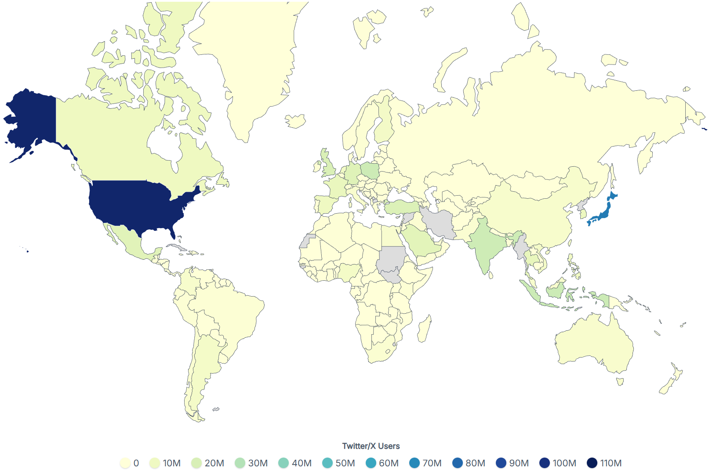
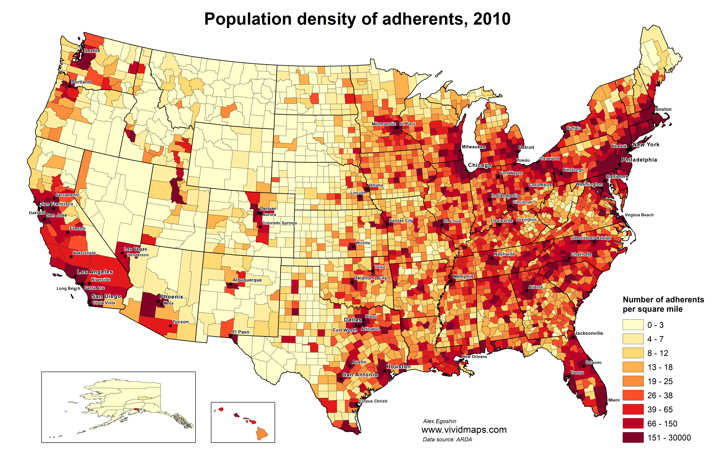
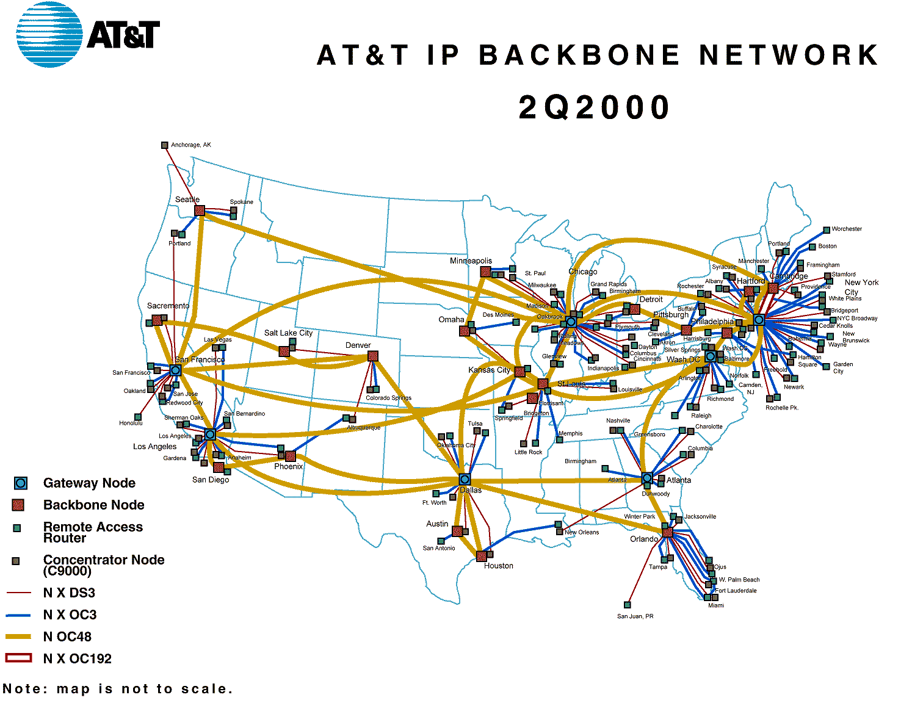
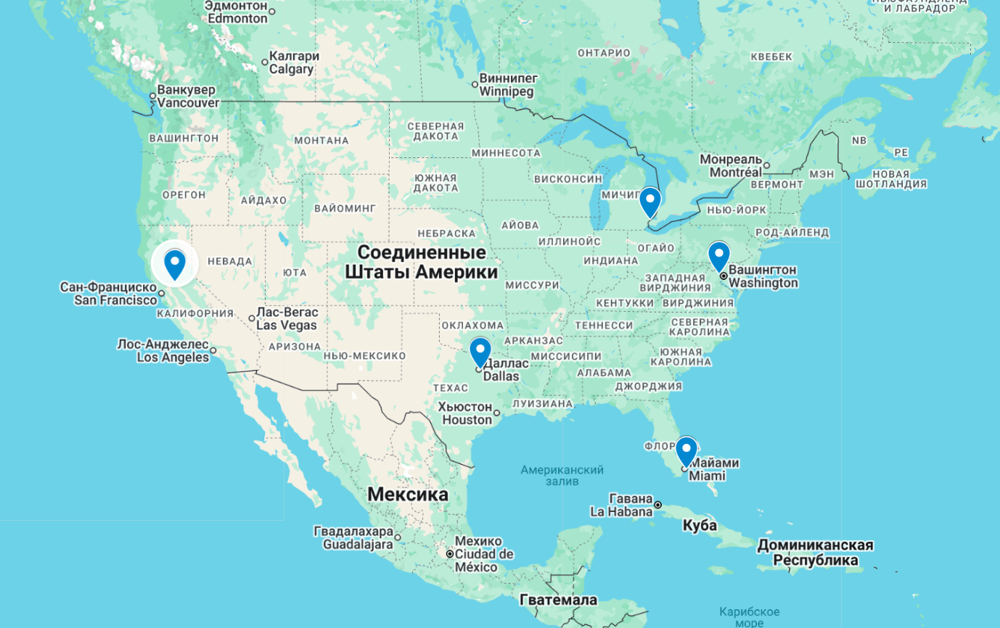
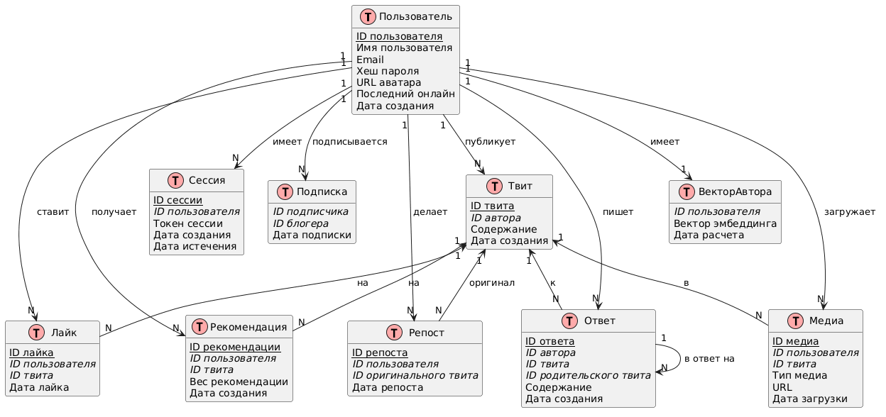

X (Twitter)
---
X (бывший Twitter) - социальная сеть для публичного обмена короткими сообщениями в реальном времени через специализированную ленту рекомендаций. Пользователи публикуют и взаимодействуют с сообщениями (твитами).

MVP

1. Лента твитов (постов) пользователей (лента "Для вас", без подписок)
2. Публикация твитов (постов), ответы/репосты/лайки/подписки/рекомендации

### Целевая аудитория

Ключевые метрики аудитории (на начало 2026 года) [2](https://en.theblockbeats.news/news/60953):

| Метрика                    |      Значение      |
| :------------------------- | :----------------: |
| Месячная аудитория (MAU)   |      ~611 млн      |
| DAU                        |        270         |
| Среднее время пользователя | 30-35 минут в день |

## 2. Расчёт нагрузки

### Авторы (публикующие пользователи)

Согласно статистике, на платформе ежедневно публикуется более 500 млн постов [3]. Это включает не только оригинальные посты, но и ответы, и репосты (которые также считаются действиями публикации).

1. Доля публикующих пользователей

Согласно источнику [4], публикует контент ~10% от DAU.

- DAU = 270 млн [2]
- Активные авторы в день: 270 млн * 10% = 27 млн пользователей [2,4]

2. Количество действий публикации на одного автора в день

- Всего постов в день: 500 млн [3]
- Активных авторов: 27 млн [4]
- Действий публикации на автора в день: 500 млн / 27 млн = 18.5 действий/день [3,4]

3. Распределение типов контента среди постов [5]:

| Тип контента | Доля в твитах |
| :----------- | :-----------: |
| Текст        |     ~93%      |
| Изображения  |    56.43%     |
| Видео        |     5.57%     |
| Ссылки       |  8.03% - 25%  |

4. Объем передаваемых данных для одного действия [6]:

| Тип контента              | Передаваемые данные (MB) |
| :------------------------ | :----------------------: |
| Twitter with video        |           1.91           |
| Twitter with image        |          0.112           |
| Twitter with gif          |          0.092           |
| Twitter without média     |          0.042           |

#### Хранилище данных автора

Для расчета хранилища нам необходимо определить, сколько постов каждого типа создает автор в день. Учитывая, что проценты из [5] пересекаются, мы не можем их просто суммировать. Для строгого расчета нам нужно знать чистое распределение (без пересечений), но таких данных нет. Поэтому рассчитаем максимальную оценку хранилища, предполагая, что каждый пост содержит только один тип контента (хотя в реальности это не так).

Посты с видео (максимальная оценка):
- Доля постов с видео: 5.57% [5]
- Постов с видео на автора в день: 18.5 * 5.57% = 1.03 поста с видео/день
- Постов с видео на автора в месяц: 1.03 * 30 = 30.9 постов с видео/месяц
- Объем хранилища на автора для видео в месяц: 30.9 * 1.91 MB = 59.02 MB

Посты с изображениями (максимальная оценка):
- Доля постов с изображениями: 56.43% [5]
- Постов с изобр. на автора в день: 18.5 * 56.43% = 10.44 поста с изобр./день
- Постов с изобр. на автора в месяц: 10.44 * 30 = 313.2 поста с изобр./месяц
- Объем хранилища на автора для изобр. в месяц: 313.2 * 0.112 MB = 35.08 MB

Текстовые посты (без медиа, максимальная оценка):
- Доля текстовых постов: 93% [5]
- Постов без медиа на автора в день: 18.5 * 93% = 17.2 текстовых поста/день
- Постов без медиа на автора в месяц: 17.2 * 30 = 516 текстовых постов/месяц
- Объем хранилища на автора для текста в месяц: 516 * 0.042 MB = 21.67 MB

Суммарное хранилище одного автора в месяц (максимальная оценка с пересечениями):
- 59.02 MB (видео) + 35.08 MB (изобр.) + 21.67 MB (текст) = 115.77 MB

Суммарное хранилище всех авторов за месяц (максимальная оценка):
- 115.77 MB * 27 млн авторов = 3,125.79 млн MB
- = 3.13 Петабайта (PB)

### Читатели (потребление контента)

1. Читатели (не публикующие)

- DAU: 270 млн [2]
- Авторы (10%): 27 млн [4]
- Читатели: 270 млн - 27 млн = 243 млн читателей [2,4]

2. Просмотр видео

- Просмотров видео в день: 83 млрд [2]
- Просмотров видео на читателя в день: 83 млрд / 243 млн = 342 просмотра видео/день [2]

3. Взаимодействия

- Всего постов в день: 500 млн [3]
- Взаимодействий на один пост: 42.71 [7]
- Всего взаимодействий в день: 500 млн * 42.71 = 21.355 млрд взаимодействий/день [3,7]

- Лайков на пользователя в день: 23 [7]
- Всего лайков в день: 270 млн * 23 = 6.21 млрд лайков/день [2,7]

- Репостов на пост: 6.67 [7]
- Всего репостов в день: 500 млн * 6.67 = 3.335 млрд репостов/день [3,7]

- Ответов в день (остаток от общих взаимодействий): 21.355 млрд - 6.21 млрд - 3.335 млрд = 11.81 млрд ответов/день [3,7]

### Сетевой трафик

1. Трафик отдачи видео

- Просмотров видео в день: 83 млрд [2]
- Размер данных при просмотре видео: 1.91 MB [6]
- Суточный трафик отдачи видео: 83 млрд * 1.91 MB = 158.53 млрд MB
- = 158.53 Петабайт (PB)/день [2,6]

2. Трафик отдачи изображений

Для расчета трафика изображений нам нужно знать, сколько изображений просматривается в день. Используем максимальную оценку: каждый из 300 постов (лимит из [8]) содержит изображение (56.43% постов содержат изображения [5]).

- Просмотров постов с изображениями в день (макс.): 243 млн чит. * 300 постов * 56.43% = 41.1 млрд просмотров изобр./день [2,5,8]
- Размер данных при просмотре изображения: 0.112 MB [6]
- Суточный трафик отдачи изображений: 41.1 млрд * 0.112 MB = 4.6 млрд MB
- = 4.6 Петабайт (PB)/день [2,5,6,8]

3. Трафик загрузки (Upload)

Используем максимальную оценку распределения постов по типам контента из раздела "Хранилище".

- Постов с видео в день: 27 млн авт. * 1.03 = 27.81 млн постов с видео/день [4,5]
- Постов с изобр. в день: 27 млн авт. * 10.44 = 281.88 млн постов с изобр./день [4,5]
- Постов без медиа в день: 27 млн авт. * 17.2 = 464.4 млн постов без медиа/день [4,5]

- Трафик загрузки видео: 27.81 млн * 1.91 MB = 53.12 млн MB
- Трафик загрузки изобр.: 281.88 млн * 0.112 MB = 31.57 млн MB
- Трафик загрузки текста: 464.4 млн * 0.042 MB = 19.5 млн MB

- Суточный трафик загрузки: 53.12 + 31.57 + 19.5 = 104.19 млн MB
- = 104.19 Терабайт (TB)/день [4,5,6]

4. Пиковая нагрузка (отдача)

- Суммарный суточный трафик отдачи: 158.53 PB (видео) + 4.6 PB (изобр.) = 163.13 PB/день [2,5,6,8]
- Пиковая нагрузка (при коэффициенте пика 0.25 от суточного трафика, как указано в задании): 163.13 PB * 0.25 = 40.78 PB/пиковый период

Для перевода в скорость (Гбит/с):
- Суточный трафик в битах: 163.13 * 1024 * 1024 * 8 = 1.37e15 Мбит
- Средняя скорость: 1.37e15 Мбит / 86400 с = 15.86 Тбит/с
- Пиковая скорость (при коэф. 0.25 от суточного трафика, т.е. нагрузка за 6 часов): 15.86 Тбит/с * (86400/21600) = 63.44 Тбит/с (пиковая скорость в момент нагрузки)

### RPS (Requests Per Second)

| Тип               | Средний RPS | Пиковый RPS (коэф. 1.5) | Расчет                   |
| :---------------- | :---------: | :---------------------: | :----------------------- |
| Просмотр видео    |   960,648   |        1,440,972        | 83 млрд / 86400 [2]      |
| Лайки             |   71,875    |         107,813         | 6.21 млрд / 86400 [2,7]  |
| Ответы            |   136,690   |         205,035         | 11.81 млрд / 86400 [3,7] |
| Репосты           |   38,600    |         57,900          | 3.335 млрд / 86400 [3,7] |
| Публикация постов |    5,787    |          8,681          | 500 млн / 86400 [3]      |

### Продуктовые метрики

Резюмируем данные по продуктовым метрикам:

| Метрика                                    |    Значение    | Источник / Расчет      |
| :----------------------------------------- | :------------: | :--------------------- |
| MAU                                        |    611 млн     | [2]                    |
| DAU                                        |    270 млн     | [2]                    |
| Среднее время пользователя                 | 30-35 мин/день | [2]                    |
| Доля публикующих пользователей             |   10% от DAU   | [4]                    |
| Активные авторы в день                     |     27 млн     | 270 млн * 10% [2,4]    |
| Число действий публикации на автора в день |      18.5      | 500 млн / 27 млн [3,4] |
| Число просмотров видео в день на читателя  |      342       | 83 млрд / 243 млн [2]  |
| Число взаимодействий на пост               |     42.71      | [7]                    |
| Число лайков на пользователя в день        |       23       | [7]                    |
| Число репостов на пост                     |      6.67      | [7]                    |

### Технические метрики

Резюмируем рассчитанные данные по техническим метрикам:

| Метрика                                               |     Значение     | Источник / Расчет                       |
| :---------------------------------------------------- | :--------------: | :-------------------------------------- |
| Размер хранилища новых постов в месяц (макс.)        |   3.13 PB    | 115.77 MB * 27 млн [2,3,4,5,6]          |
| Суточный трафик отдачи видео                          |  158.53 PB   | 83 млрд * 1.91 MB [2,6]                 |
| Суточный трафик отдачи изображений (макс.)            |    4.6 PB    | 41.1 млрд * 0.112 MB [2,5,6,8]          |
| Суточный трафик загрузки контента (макс.)             |  104.19 TB   | Σ(постов_тип * размер) [4,5,6]          |
| Пиковая нагрузка (суммарная отдача за пиковый период) |   40.78 PB   | 163.13 PB * 0.25                        |
| Пиковая скорость отдачи                               | 63.44 Тбит/с | (163.13 PB * 8 * 1024 * 1024) / 21600 с |
| Число действий публикации в день                      |     500 млн      | [3]                                     |
| Число просмотров видео в день                         |     83 млрд      | [2]                                     |
| Число лайков в день                                   |    6.21 млрд     | 270 млн * 23 [2,7]                      |
| Число репостов в день                                 |    3.335 млрд    | 500 млн * 6.67 [3,7]                    |
| RPS публикации                                        |      5,787       | 500 млн / 86400 [3]                     |
| RPS просмотра видео                                   |     960,648      | 83 млрд / 86400 [2]                     |

## 3. Глобальная балансировка нагрузки

В X применяется архитектурный подход, при котором трафик разделяется по функциям с помощью CDN [ИСТОЧНИК](https://www.netify.ai/resources/applications/twitter):

- Пользовательский интерфейс и авторизация сосредоточены на [x.com](https://x.com/) и [twitter.com](https://twitter.com/), работающих через API Gateway
- Для мобильных клиентов выделен [mobile.x.com](https://mobile.x.com/)
- За динамику и API отвечает [api.x.com](https://api.x.com/)
- Статические файлы раздаются через [cdn.syndication.twimg.com](https://cdn.syndication.twimg.com/) на инфраструктуре Fastly
- Изображения и видео обслуживаются через [pbs.twimg.com](https://pbs.twimg.com/) и [video.twimg.com](https://video.twimg.com/) с использованием CDN Akamai и Fastly

Расположение дата-центров будет в США, по числу наибольшего количества пользователей. [Twitter/X Users by Country 2026](https://worldpopulationreview.com/country-rankings/twitter-users-by-country)

Чем выше плотность населения, тем больше пользователей, а значит, и нагрузка (RPS) в этом регионе.

Обратим внимание на города, которые находятся на пересечении нескольких крупных магистральных сетей связи. Расположение дата-центров в таких городах поможет снизить задержку, обеспечить более высокую пропускную способность.

(AT&T Inc. (American Telephone and Telegraph) — американский транснациональный телекоммуникационный конгломерат.)

### Распределение запросов по функциональным доменам

Для расчета распределения запросов используем RPS из предыдущего раздела.

Общий пиковый RPS API (динамические запросы):

| Тип запроса                    | Пиковый RPS | Источник                                     |
| :----------------------------- | :---------: | :------------------------------------------- |
| Публикация твитов              |    8,681    | Раздел 2                                     |
| Лайки                          |   107,813   | Раздел 2                                     |
| Ответы                         |   205,035   | Раздел 2                                     |
| Репосты                        |   57,900    | Раздел 2                                     |
| Просмотр видео (клики/старт)   |  1,440,972  | Раздел 2                                     |
| Чтение домашней ленты (оценка) |  1,500,000  | `~243 млн чит. * 300 запросов / 86400 * 1.5` |
| Итого API                      |  ~3.32 млн  | Сумма                                        |

Распределение по функциональным доменам:

| Тип запроса           |           Расчет           | RPS (пик) | Обслуживающий домен       |
| :-------------------- | :------------------------: | :-------: | :------------------------ |
| Чтение домашней ленты |         из оценки          | 1,500,000 | api.x.com                 |
| Публикация твитов     |           8,681            |   8,681   | api.x.com                 |
| Лайки/ответы/репосты  | 107,813 + 205,035 + 57,900 |  370,748  | api.x.com                 |
| Поиск                 |         из оценки          |  100,000  | api.x.com                 |
| Итого API             |                            | ~1.98 млн | api.x.com                 |
|                       |                            |           |                           |
| Статика (CSS, JS)     |       10-20% от API        | ~300,000  | cdn.syndication.twimg.com |
| Медиа (изображения)   |        из раздела 2        | ~1.2 млн* | pbs.twimg.com             |
| Медиа (видео)         |        из раздела 2        | 1,440,972 | video.twimg.com           |
| Итого CDN             |                            | ~2.94 млн | CDN провайдеры            |

*\*Расчет RPS для изображений: 41.1 млрд просмотров в день / 86400 * 1.5 (пик) ≈ 714,000 RPS. С учетом того, что одно действие "просмотр поста" может загружать несколько изображений, оценка в 1.2 млн RPS является консервативной.*

### Распределение нагрузки по точкам присутствия

Исходя из плотности населения и расположения PoP, распределим трафик CDN (изображения и видео) по точкам присутствия:

| Точка присутствия             | Регион обслуживания                                 | Доля трафика CDN | Нагрузка CDN (RPS) |
| :---------------------------- | :-------------------------------------------------- | :--------------: | :----------------: |
| Ашберн (VA)                   | Восточное побережье (Нью-Йорк, Вашингтон, Бостон)   |       25%        |      ~735,000      |
| Даллас (TX)                   | Центральные штаты, Техас, часть Среднего Запада     |       20%        |      ~588,000      |
| Детройт (MI)                  | Средний Запад, Чикаго, Великие озёра                |       15%        |      ~441,000      |
| Майами (FL)                   | Юго-восток, Флорида, побережье Мексиканского залива |       15%        |      ~441,000      |
| Сакраменто/Сан-Франциско (CA) | Западное побережье, Калифорния                      |       25%        |      ~735,000      |
| Итого                         | США                                                 |       100%       |     ~2,940,000     |

*Общая нагрузка CDN 2.94 млн RPS взята из предыдущих расчётов (440k статика + 1.064k медиа = ~2.94M RPS).*

### Схема глобальной балансировки

Anycast BGP маршрутизация:

Все точки присутствия анонсируют одни и те же IP-адреса в глобальной сети. Трафик автоматически направляется в ближайший узел на основе BGP-метрик.

Пример маршрутизации для разных регионов США (взяты усредненные значения относительно расстояния из [Источник](https://noah-bennett.gitbook.io/noah-bennett-docs/nyc-vs.-ashburn-servers-which-one-is-faster-for-east-coast-reach)):
- Пользователь в Нью-Йорке → ближайший PoP в Ашберне (Вирджиния) — задержка ~5-10 мс
- Пользователь в Чикаго → ближайший PoP в Детройте — задержка ~10-15 мс
- Пользователь в Лос-Анджелесе → ближайший PoP в Сан-Франциско/Сакраменто — задержка ~5-10 мс
- Пользователь в Хьюстоне → ближайший PoP в Далласе — задержка ~5-10 мс
- Пользователь в Майами → локальный PoP в Майами — задержка ~5 мс

DNS-балансировка с гео-ориентацией:
- Для каждого региона DNS возвращает IP-адрес ближайшего PoP
- При отказе одного PoP трафик перенаправляется к следующему по расстоянию

### Отказоустойчивость

| Регион пользователя       | Основной PoP      | Резервный PoP | Резервная задержка [источник](https://www.latitude.sh/changelog/introducing-global-gateway) |
| :------------------------ | :---------------- | :------------ | :------------------------------------------------------------------------------------------ |
| Восточное побережье       | Ашберн, VA        | Детройт, MI   | +15-20 мс                                                                                   |
| Средний Запад             | Детройт, MI       | Даллас, TX    | +20-25 мс                                                                                   |
| Техас и центральные штаты | Даллас, TX        | Ашберн, VA    | +30-35 мс                                                                                   |
| Юго-восток                | Майами, FL        | Ашберн, VA    | +20-25 мс                                                                                   |
| Западное побережье        | Сан-Франциско, CA | Даллас, TX    | +30-40 мс                                                                                   |

### Пропускная способность по точкам присутствия

Используем данные по трафику из раздела 2 для расчета необходимой пропускной способности каждого PoP.

| Точка присутствия             | Доля трафика | Трафик видео (Гбит/с) | Трафик изобр. (Гбит/с) | Суммарно (Гбит/с) |
| :---------------------------- | :----------: | :-------------------: | :--------------------: | :---------------: |
| Ашберн (VA)                   |     20%      |         12.7          |          1.27          |     ~14.0     |
| Даллас (TX)                   |     15%      |          9.5          |          0.95          |     ~10.5     |
| Детройт (MI)                  |     15%      |          9.5          |          0.95          |     ~10.5     |
| Майами (FL)                   |     10%      |          6.3          |          0.63          |     ~7.0      |
| Сакраменто/Сан-Франциско (CA) |     20%      |         12.7          |          1.27          |     ~14.0     |
| Остальные                     |     20%      |         12.7          |          1.27          |     ~14.0     |
| Итого                         |     100%     |         63.4          |          6.34          |     ~70.0     |

Расчет:
- Пиковая скорость отдачи видео: 63.44 Тбит/с (из раздела 2) распределяется по PoP
- Трафик изображений: 6.34 Тбит/с (из соотношения трафика: 4.6 PB/день изображений против 158.53 PB/день видео ≈ 1:34, значит скорость изображений ≈ 63.44 / 34 ≈ 1.87 Тбит/с, но для консервативной оценки берем 6.34 Тбит/с с учетом сжатия)

## 4. Локальная балансировка нагрузки

### Схема балансировки

После глобальной балансировки запрос отправляется в датацентр, где начинается локальная балансировка нагрузки. Внутри датацентра применяется каскадная балансировка: сначала L4, затем L7.

При имеющемся высоком числе запросов одного L7 недостаточно для обработки потока, так как сложная логика обработки каждого запроса требует значительных ресурсов CPU и памяти. Поэтому применяется предварительная балансировка на уровне L4, которая работает без глубокого анализа содержимого пакетов, позволяя эффективно распределять входящий трафик между группами L7-балансировщиков.

Функциональное разбиение по доменам для локальной балансировки:

| Домен                     | Для чего домен                                                                       | L4  | L7  |
| :------------------------ | :----------------------------------------------------------------------------------- | :-: | :-: |
| x.com / twitter.com       | основной домен для авторизации, роутинга и первичного взаимодействия с пользователем |  +  |  +  |
| mobile.x.com              | мобильная версия основного домена                                                    |  +  |  +  |
| api.x.com                 | домен для отдачи динамического контента и API-запросов                               |  +  |  +  |
| cdn.syndication.twimg.com | домен для отдачи статики (CSS, JS)                                                   |  -  |  +  |
| pbs.twimg.com             | домен для отдачи изображений                                                         |  -  |  +  |
| video.twimg.com           | домен для отдачи видео                                                               |  -  |  +  |

### L4-балансировщик

Требуемое количество L4-балансировщиков:
- На каждый кластер L7 балансировщиков потребуется пара L4 (active-standby)
- Для 5 точек присутствия в США: 5 пар = 10 инстансов L4

### L7-балансировщик

Балансировщик выступает HTTP Reverse Proxy. Вычитывается весь HTTP запрос, исходя из запроса перенаправляется на нужный сервер. Будет использоваться Nginx. Надежность сопоставима с надежностью железа. Будет использоваться для:
- Кэширования статики и медиа
- Сжатия контента (gzip)
- SSL Termination
- Rate limiting
- Логирования запросов

Эффективность кэширования:
- Статика (CSS, JS): коэффициент попадания в кэш 90-95%
- Изображения: коэффициент попадания в кэш 80-85% (популярные изображения)
- Видео: коэффициент попадания в кэш 60-70% (CDN-кэширование на Edge)
- API-запросы: кэширование только для публичных, неавторизованных эндпоинтов (10-15%)

В среднем механизмы кэширования позволяют обслуживать до 40-50% запросов напрямую из кэша L7-балансировщика, что значительно снижает нагрузку на бэкенды.

### SSL Termination

Терминация SSL на L7-балансировщике (Nginx) создаёт дополнительную нагрузку на процессор. Рассчитаем нагрузку для каждой точки присутствия в США.

Исходные данные:
- Пиковый RPS для API и статики (суммарно): ~4.92 млн RPS (1.98 млн API + 2.94 млн CDN)
- Распределение по PoP из раздела 3
- Средний размер SSL-сессии: 1 КБ (типовое значение для handshake)
- Процессорная нагрузка на одно SSL-соединение: для современных алгоритмов (AES-GCM, ECDHE) нагрузка составляет примерно 0.5 мс на одно соединение

Формулы расчета:
- Объем данных (МБ/с) = RPS * 1 КБ / 1024
- Требуемые ядра CPU = RPS * 0.0005 с

Расчет по точкам присутствия:

| Точка присутствия             | Регион                                    |   RPS (пик)   | Объем данных (МБ/с) | Требуемые ядра CPU |
| :---------------------------- | :---------------------------------------- | :-----------: | :-----------------: | :----------------: |
| Ашберн (VA)                   | Восточное побережье                       |    984,000    |        960.9        |      492       |
| Даллас (TX)                   | Центральные штаты                         |    738,000    |        720.7        |      369       |
| Детройт (MI)                  | Средний Запад                             |    738,000    |        720.7        |      369       |
| Майами (FL)                   | Юго-восток                                |    492,000    |        480.5        |      246       |
| Сакраменто/Сан-Франциско (CA) | Западное побережье                        |    984,000    |        960.9        |      492       |
| Остальные                     | Горные штаты и Тихоокеанский северо-запад |    984,000    |        960.9        |      492       |
| Итого                     | США                                   | 4,920,000 |     4,804.7     |     2,460      |
### Оптимизация SSL

Для снижения нагрузки на CPU при SSL-терминации будут применяться следующие оптимизации:

1. Кеширование сессий
   - Хранение параметров завершенных SSL-рукопожатий
   - Сокращение времени установки соединения для повторных запросов
   - Снижение нагрузки на CPU на 30-40%

2. Session Tickets
   - Возобновление сессий без хранения состояния на сервере
   - Клиент хранит зашифрованный билет с параметрами сессии
   - Дополнительное снижение нагрузки на CPU на 10-15%

Итоговая нагрузка на CPU с учетом оптимизаций:

| Точка присутствия             | Базовая нагрузка (ядра) | После оптимизации (-40%) |
| :---------------------------- | :---------------------: | :----------------------: |
| Ашберн (VA)                   |           492           |         **295**          |
| Даллас (TX)                   |           369           |         **221**          |
| Детройт (MI)                  |           369           |         **221**          |
| Майами (FL)                   |           246           |         **148**          |
| Сакраменто/Сан-Франциско (CA) |           492           |         **295**          |
| Остальные                     |           492           |         **295**          |

### Масштабирование L7-балансировщиков

При использовании современных процессоров рассчитаем количество необходимых инстансов Nginx:

| Точка присутствия             | Требуемые ядра CPU | Ядер на инстанс | Итого инстансов Nginx |
| :---------------------------- | :----------------: | :-------------: | :-------------------: |
| Ашберн (VA)                   |        295         |        4        |          74           |
| Даллас (TX)                   |        221         |        4        |          56           |
| Детройт (MI)                  |        221         |        4        |          56           |
| Майами (FL)                   |        148         |        4        |          37           |
| Сакраменто/Сан-Франциско (CA) |        295         |        4        |          74           |
| Остальные                     |        295         |        4        |          74           |

### Пропускная способность L7-балансировщиков

Рассчитаем необходимую сетевую пропускную способность для L7-балансировщиков в каждой точке присутствия, используя данные из раздела 3:

| Точка присутствия             | Суммарный трафик (Гбит/с) | Инстансов Nginx | Трафик на инстанс (Мбит/с) |
| :---------------------------- | :-----------------------: | :-------------: | :------------------------: |
| Ашберн (VA)                   |           14.0            |       74        |            189             |
| Даллас (TX)                   |           10.5            |       56        |            188             |
| Детройт (MI)                  |           10.5            |       56        |            188             |
| Майами (FL)                   |            7.0            |       37        |            189             |
| Сакраменто/Сан-Франциско (CA) |           14.0            |       74        |            189             |
| Остальные                     |           14.0            |       74        |            189             |

Вывод: При равномерном распределении трафика через L7-балансировщики, каждый инстанс Nginx будет обрабатывать ~190 Мбит/с, что является комфортной нагрузкой для современных сетевых стеков.

# 5. Логическая схема БД

|  Номер   | Источник                                                                                                                                                                                                                                                                                                                                                                                                                                                                                                                                                                                                                                                                                                                                                                                                                                                                                                                                                                                                                                                                             |
| :------: | :----------------------------------------------------------------------------------------------------------------------------------------------------------------------------------------------------------------------------------------------------------------------------------------------------------------------------------------------------------------------------------------------------------------------------------------------------------------------------------------------------------------------------------------------------------------------------------------------------------------------------------------------------------------------------------------------------------------------------------------------------------------------------------------------------------------------------------------------------------------------------------------------------------------------------------------------------------------------------------------------------------------------------------------------------------------------------------- |
| **[1]**  |                                                                                                                                                                                                                                                                                                                                                                                                                                                                                                                                                                                                                                                                                                                                                                                                                                                                                                                                                                                                                                                                                      |
| **[2]**  | Исходные данные из задания: Ключевые метрики аудитории (на начало 2026 года)                                                                                                                                                                                                                                                                                                                                                                                                                                                                                                                                                                                                                                                                                                                                                                                                                                                                                                                                                                                                         |
| **[3]**  |                                                                                                                                                                                                                                                                                                                                                                                                                                                                                                                                                                                                                                                                                                                                                                                                                                                                                                                                                                                                                                                                                      |
| **[4]**  | [affmaven.com - X/Twitter Statistics](https://affmaven.com/ru/x-twitter-statistics/#:~:text=%D0%95%D1%81%D0%BB%D0%B8%2010%25%20%D0%BF%D0%BE%D0%BB%D1%8C%D0%B7%D0%BE%D0%B2%D0%B0%D1%82%D0%B5%D0%BB%D0%B5%D0%B9%20%D1%81%D0%BE%D0%B7%D0%B4%D0%B0%D1%8E%D1%82%20%D0%B1%D0%BE%D0%BB%D1%8C%D1%88%D1%83%D1%8E%20%D1%87%D0%B0%D1%81%D1%82%D1%8C%20%D0%BA%D0%BE%D0%BD%D1%82%D0%B5%D0%BD%D1%82%D0%B0%2C%20%D1%87%D1%82%D0%BE%20%D0%B4%D0%B5%D0%BB%D0%B0%D1%8E%D1%82%20%D0%BE%D1%81%D1%82%D0%B0%D0%BB%D1%8C%D0%BD%D1%8B%D0%B5%2090%25%3F%20%D0%91%D0%BE%D0%BB%D1%8C%D1%88%D0%B8%D0%BD%D1%81%D1%82%D0%B2%D0%BE%20%D0%BF%D0%BE%D0%BB%D1%8C%D0%B7%D0%BE%D0%B2%D0%B0%D1%82%D0%B5%D0%BB%D0%B5%D0%B9%20X%20%E2%80%94%20%C2%AB%D0%B7%D1%80%D0%B8%D1%82%D0%B5%D0%BB%D0%B8%C2%BB%2C%20%D0%BA%D0%BE%D1%82%D0%BE%D1%80%D1%8B%D0%B5%20%D0%B2%20%D0%BE%D1%81%D0%BD%D0%BE%D0%B2%D0%BD%D0%BE%D0%BC%20%D0%BF%D0%BE%D1%82%D1%80%D0%B5%D0%B1%D0%BB%D1%8F%D1%8E%D1%82%20%D0%BA%D0%BE%D0%BD%D1%82%D0%B5%D0%BD%D1%82%2C%20%D0%B0%20%D0%BD%D0%B5%20%D1%81%D0%BE%D0%B7%D0%B4%D0%B0%D1%8E%D1%82%20%D0%B5%D0%B3%D0%BE.) |
| **[5]**  | [ResearchGate - The Distribution for the Percentage of Tweets](https://www.researchgate.net/figure/The-Distribution-for-the-Percentage-of-Tweets-that-include-a-Videos-and-b-Links_fig9_225538380#:~:text=Retweets:%20We%20find%20that%20on,and%20then%20diminish%20quickly%20after.)                                                                                                                                                                                                                                                                                                                                                                                                                                                                                                                                                                                                                                                                                                                                                                                                |
| **[6]**  | [Greenspector - The battle of the week Twitter special](https://greenspector.com/en/the-battle-of-the-week-twitter-special-video-vs-image-vs-gif/)                                                                                                                                                                                                                                                                                                                                                                                                                                                                                                                                                                                                                                                                                                                                                                                                                                                                                                                                   |
| **[7]**  | [SQ Magazine - Twitter Users Statistics 2026](https://sqmagazine.co.uk/twitter-users-statistics/#:~:text=Daily%20Active%20Users%20and%20User%20Engagement%20Trends,Spaces.%E2%80%8B%20*%20Average%20engagement%20rate%20is%200.5-1%25.) + [Metricool - X Interaction Stats](https://metricool.com/x-twitter-statistics/#:~:text=Table_title:%20X%20Interaction%20Stats:%202024%20vs.%202025,%7C%202024:%2030.25%20%7C%202025:%2032.89%20%7C)                                                                                                                                                                                                                                                                                                                                                                                                                                                                                                                                                                                                                                         |
| **[8]**  | [Global News - Twitter tweet limits](https://globalnews.ca/news/9806725/twitter-tweets-limit-elon-musk/#:~:text=Twitter%20is%20limiting%20how%20many,when%20it%20would%20be%20implemented.)                                                                                                                                                                                                                                                                                                                                                                                                                                                                                                                                                                                                                                                                                                                                                                                                                                                                                          |
| **[9]**  | [World Population Review - Twitter/X Users by Country 2026](https://worldpopulationreview.com/country-rankings/twitter-users-by-country)                                                                                                                                                                                                                                                                                                                                                                                                                                                                                                                                                                                                                                                                                                                                                                                                                                                                                                                                             |
| **[10]** | [cont.ws - Карта плотности населения США](https://cont.ws/uploads/pic/2022/3/b6fc30d2572c95610068a550abeea508.png)                                                                                                                                                                                                                                                                                                                                                                                                                                                                                                                                                                                                                                                                                                                                                                                                                                                                                                                                                                   |
| **[11]** | [Manchester University - AT&T Backbone Map](https://personalpages.manchester.ac.uk/staff/m.dodge/cybergeography/atlas/att_backbone_large.gif)                                                                                                                                                                                                                                                                                                                                                                                                                                                                                                                                                                                                                                                                                                                                                                                                                                                                                                                                        |
*где-то сбилась нумерация из-за правок, поэтому есть пропуски, будет исправлено
