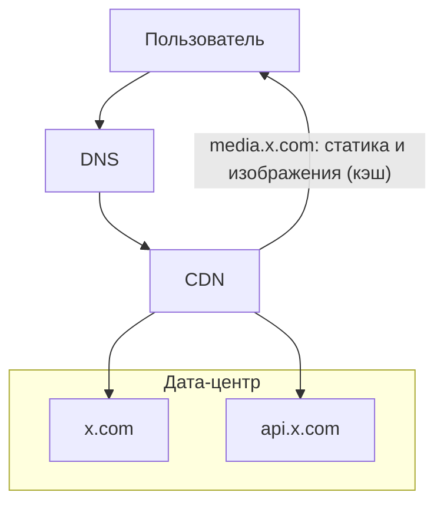
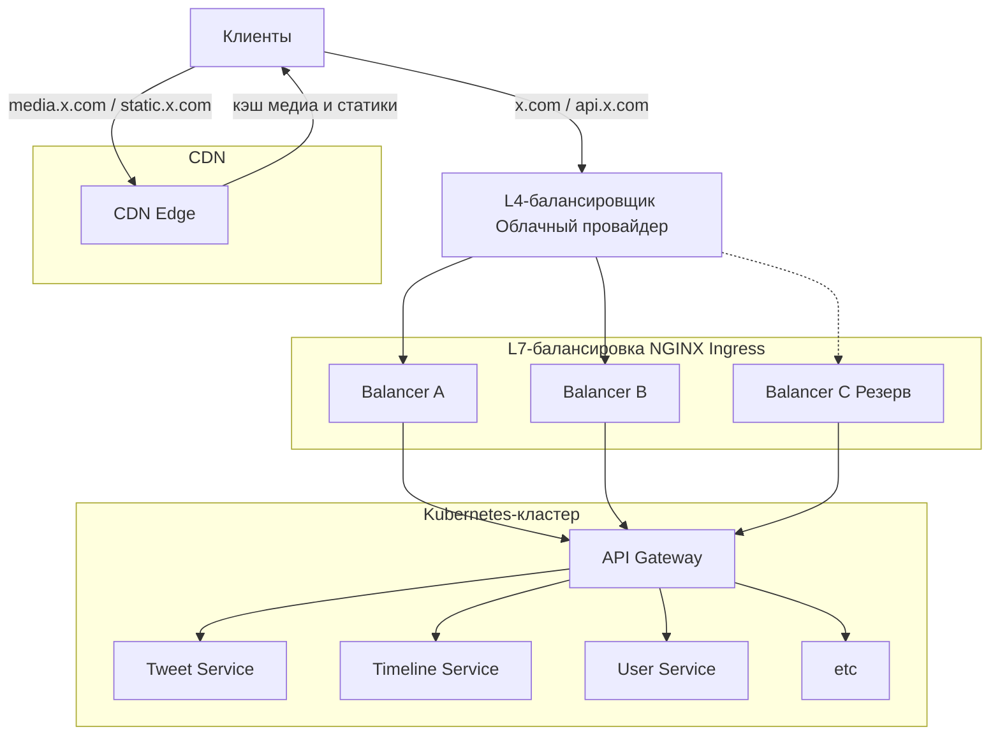
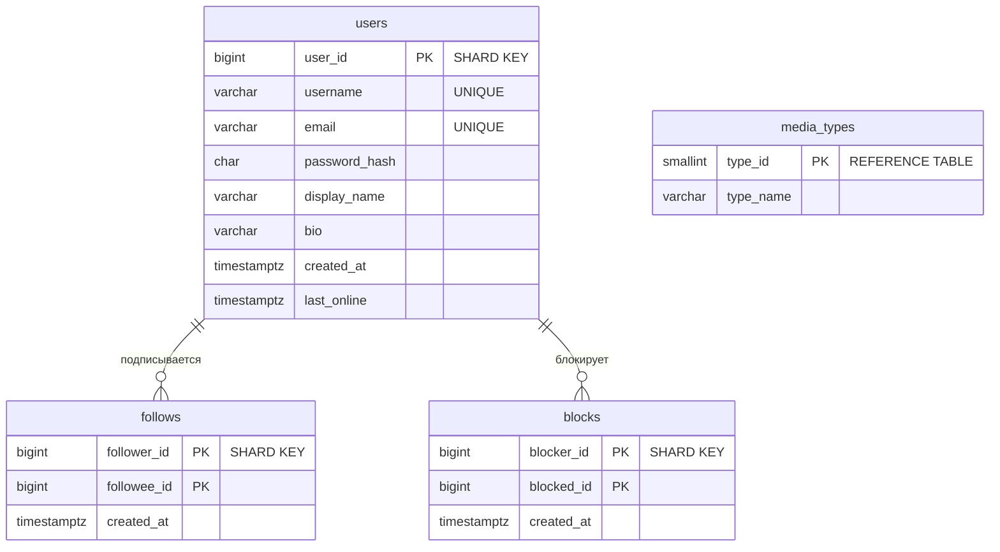
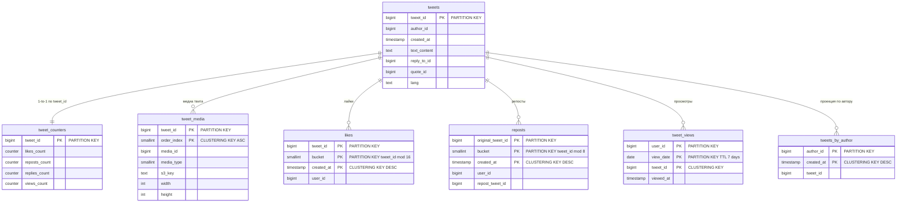
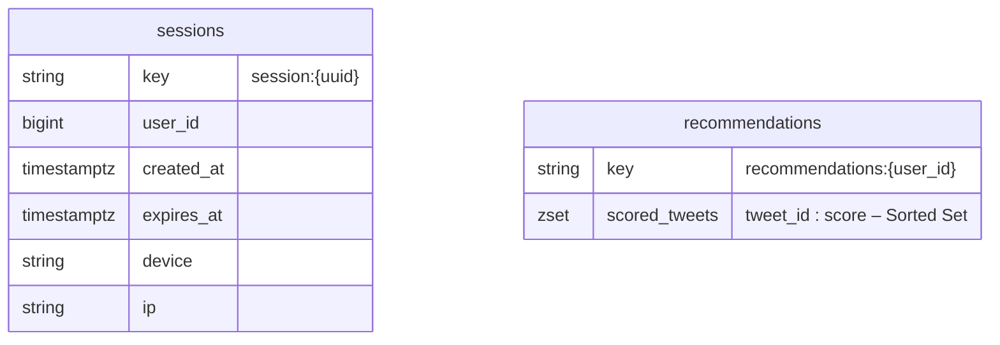
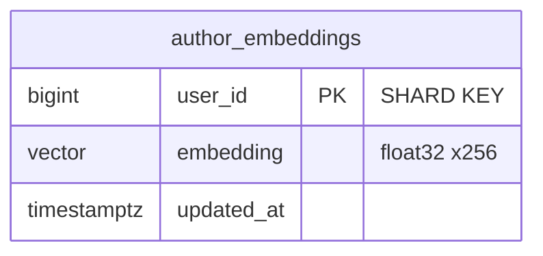
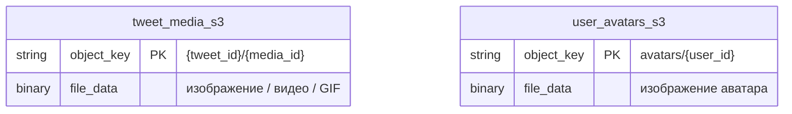
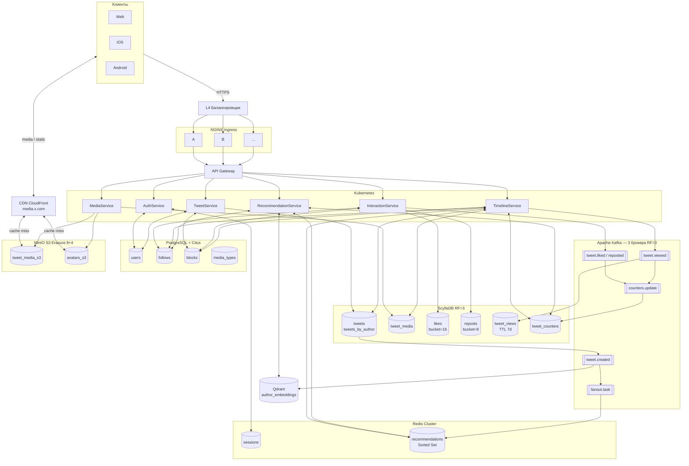

X (Twitter)
---
X (бывший Twitter) - социальная сеть для публичного обмена короткими сообщениями в реальном времени через специализированную ленту рекомендаций. Пользователи публикуют и взаимодействуют с сообщениями (твитами).

MVP

1. Лента твитов (постов) пользователей (лента "Для вас", без подписок)
2. Публикация твитов (постов), ответы/репосты/лайки/подписки/рекомендации

Статистика далее взята из источника [1]

#### Демография пользователей

| Категория   | Доля (2025) |
| :---------- | :---------- |
| Мужчины | 63,7%       |
| Женщины | 36,3%       |
#### Распределение по возрасту

| Возрастная группа | Доля мужчин | Доля женщин | Общая доля |
| :---------------- | :---------- | :---------- | :--------- |
| 13–17             | 1,0%        | 1,0%        | 2,0%       |
| 18–24             | 18,9%       | 13,2%       | 32,1%      |
| **25–34**         | **24,5%**   | **13,0%**   | **37,5%**  |
| 35–49             | 14,2%       | 6,9%        | 21,1%      |
| 50+               | 4,8%        | 2,5%        | 7,3%       |

#### Количество пользователей по странам

| **Страна**        | **Количество пользователей X (в миллионах)** |
| ----------------- | -------------------------------------------- |
| США               | 104                                          |
| Япония            | 70.9                                         |
| Индонезия         | 25.2                                         |
| Индия             | 24.1                                         |
| Великобритания    | 22.9                                         |
| Германия          | 21.6                                         |
| Турция            | 19.7                                         |
| Мексика           | 16.9                                         |
| Бразилия          | 16                                           |
| Саудовская Аравия | 15.7                                         |

#### Распределение трафика по странам

| **Ранг** | **Страна** | **Доля трафика** |
| -------- | ---------- | ---------------- |
| 1        | США        | 22.69%           |
| 2        | Япония     | 13.83%           |
| 3        | Бразилия   | 5.04%            |
| 4        | Турция     | 4.32%            |
| 5        | Индия      | 4.07%            |

#### Причины использования платформы

| Причина                         | Доля пользователей |
| :------------------------------ | :----------------- |
| Чтение новостей                 | 59%                |
| Слежение за брендами/компаниями | 38,1%              |
| Развлекательный контент         | 35,7%              |
| Публикация фото и видео         | 28,3%              |
| Общение с друзьями и семьей     | 19,4%              |

#### Продуктовые метрики

Источник [3](https://dataresearchtools.com/twitter-x-active-users-statistics-2026/)

| Показатель                                                        | Значение               | Комментарий                                       |
| :---------------------------------------------------------------- | :--------------------- | :------------------------------------------------ |
| MAU                                                               | 620 млн                |                                                   |
| Ежедневная аудитория (DAU)                                        | 248 млн пользователей  |                                                   |
| Доля авторов                                                      | 10% от DAU             |                                                   |
| Количество авторов                                                | 24,8 млн пользователей | 248 млн × 0,10 (публикует контент 10% от DAU) [2] |
| Среднее количество твитов в день                                  | 465 млн                |                                                   |
| Твитов на одного автора в день                                    | ~ 18,75                | 465 млн / 24,8 млн                                |
| Твитов на пользователя в день                                     | ~ 1,87                 | 465 млн / 248 млн                                 |
| Среднее количество ретвитов в день                                | 320 млн                |                                                   |
| Ретвитов на пользователя в день                                   | ~ 1,29                 | 320 млн / 248 млн                                 |
| Среднее количество лайков за день                                 | 2,8 млрд               |                                                   |
| Лайков на пользователя в день                                     | ~ 11,29                | 2,8 млрд / 248 млн                                |
| Средняя продолжительность сеанса                                  | 6 минут 42 секунды     |                                                   |
| Количество сеансов в день (в среднем на одного пользователя)      | 4,5                    |                                                   |
| Общее время в день на пользователя                                | ~ 30 минут 9 секунд    |                                                   |
| Среднее количество просмотров ленты в день на одного пользователя | 150                    |                                                   |
| Количество просмотров видео в день                                | 8,5 млрд               |                                                   |
| Просмотров видео на пользователя в день                           | ~ 34,27                | 8,5 млрд / 248 млн                                |
#### Список источников

1. [twitter-statistics](https://www.demandsage.com/twitter-statistics/)
2. [Статистика X (Twitter) 2026: информация о пользователях для маркетологов](https://affmaven.com/ru/x-twitter-statistics/#:~:text=Если%2010%25%20пользователей%20создают%20большую%20часть%20контента%2C%20что%20делают%20остальные%2090%25%3F%20Большинство%20пользователей%20X%20—%20«зрители»%2C%20которые%20в%20основном%20потребляют%20контент%2C%20а%20не%20создают%20его.)
3. [Twitter/X Active Users Statistics 2026: Complete Data Report](https://dataresearchtools.com/twitter-x-active-users-statistics-2026/) 

---

# 2. Расчёт нагрузки

Относительно документации API Twitter (X) [1](https://docs.x.com/x-api/fundamentals/data-dictionary#content-area), объект Post (твит) содержит следующие поля

|Поле|Размер|
|---|---|
|`id` (20 цифр)|20 байт|
|`text` (280 символов)|~280-560 байт (UTF-8)|
|`edit_history_tweet_ids` массив|~50 байт|
|`author_id` (19 цифр)|19 байт|
|`created_at` (24 символа)|24 байта|
|`conversation_id` (19 цифр)|19 байт|
|`public_metrics` (6 полей)|~120 байт|
|`lang` (2-5 символов)|~10 байт|
|`reply_settings` (8-10 символов)|~15 байт|

Итого в среднем ~1КБ

Размеры для расчета следующие:

|Тип твита|Размер|Комментарий/Допущения|
|---|---|---|
|Текст|1 КБ|На основе расчета|
|Изображение|195 KB|Средний размер после сжатия, взят на основе разбора сервиса по обмену фото [2](https://blog.csdn.net/gitblog_01063/article/details/150895451), примем как допущение|
|Видео|37,5 МБ|Размер обычного видео в формате 1080p с частотой 30 кадров в секунду и битрейтом 5 Мбит/с составляет около 37,5 МБ в минуту. [3](https://snxpstudio.co/resources/video-file-size-calculator/), примем как допущение, т.к. точной статистики из twitter нет|
|GIF|238 KB|среднее значение gif, взято с сайта, который предоставляет медиа статистику [4](https://infinitejest.wallacewiki.com/david-foster-wallace/index.php?title=Special:MediaStatistics), примем как допущение|

Распределение постов следующее [5](https://pmc.ncbi.nlm.nih.gov/articles/PMC10995791/table/table1/)(в источнике проводилось исследование по распределение постов на тему продовольственной безопасности, но т.к. более подробных сведений нет, берём это как допущение):

|Тип|Процент|
|---|---|
|Только текст|90|
|С изображением|9,8|
|С видео|0,1|
|С GIF-анимацией|0,2|

### Хранилище автора за месяц

| Тип контента                | Постов в день           | Постов в месяц        | Место в хранилище                 |
| :-------------------------- | :---------------------- | :-------------------- | :-------------------------------- |
| Текст                   | 18.75 * 0.90 = 16.875   | 16.875 * 30 = 506.25  | 506.25 * 0.001 МБ = 0.506 МБ  |
| Изображения             | 18.75 * 0.098 = 1.8375  | 1.8375 * 30 = 55.125  | 55.125 * 0.195 МБ = 10.749 МБ |
| Видео                   | 18.75 * 0.001 = 0.01875 | 0.01875 * 30 = 0.5625 | 0.5625 * 37.5 МБ = 21.094 МБ  |
| GIF                     | 18.75 * 0.002 = 0.0375  | 0.0375 * 30 = 1.125   | 1.125 * 0.238 МБ = 0.268 МБ   |
| Итого на автора в месяц |                         |                       | ≈ 32.62 МБ                    |

**Хранилище всех авторов за месяц:** 32.617 МБ (на автора в месяц) * 24.8 млн (количество авторов) = 808.9 млн МБ = 0.81 ПБ

### Читатели

| Читатели (не публикующие)    | 248 млн (DAU) - 24.8 млн (авторы) = 223.2 млн                                           |
| :--------------------------- | :-------------------------------------------------------------------------------------- |
| Просмотров ленты на читателя | 150                                                                                     |
| Просмотров ленты в день      | 223.2 млн * 150 = 33.48 млрд                                                            |
| Средний RPS чтения ленты     | 33.48 млрд / 86400 = 387 500                                                            |
| Видеопросмотров на читателя  | 8.5 млрд (просмотров видео в день) / 223.2 млн (читатели) = 38.1                        |
| Лайков на пользователя       | 2.8 млрд (лайков в день) / 248 млн (DAU) = 11.29                                        |
| Ретвитов на пользователя     | 320 млн (ретвитов в день) / 248 млн (DAU) = 1.29                                        |
| Взаимодействий на твит       | (2.8 млрд (лайки в день) + 0.32 млрд (ретвиты в день)) / 465 млн (твитов в день) = 6.71 |

### Сетевой трафик в день

| Отдача видео                                     | 8.5 млрд (просмотров видео в день) * 1.91 МБ (размер передаваемого видео [6](https://greenspector.com/en/the-battle-of-the-week-twitter-special-video-vs-image-vs-gif/)) = 16.24 ПБ |
| :----------------------------------------------- | :---------------------------------------------------------------------------------------------------------------------------------------------------------------------------------- |
| Отдача изображений (при 150 показах на читателя) |                                                                                                                                                                                     |
| Показов на читателя                              | 150 (показов ленты в день на читателя) * 0.098 (доля постов с изображением) = 14.7                                                                                                  |
| Всего показов                                    | 223.2 млн (читатели) * 14.7 (показов на читателя) = 3.28 млрд                                                                                                                       |
| Трафик                                           | 3.28 млрд (всего показов) * 0.195 МБ (размер изображения в МБ) = 0.64 ПБ                                                                                                            |
| **Трафик загрузки (upload)**                     |                                                                                                                                                                                     |
| Видео                                            | `24.8 млн (авторы) * 0.01875 (видео-постов на автора в день) * 37.5 (размер видео в МБ) = 17.44 млн МБ`                                                                             |
| Изображения                                      | `24.8 млн (авторы) * 1.8375 (постов с изображением на автора в день) * 0.195 (размер изображения в МБ) = 8.88 млн МБ`                                                               |
| Текст                                            | `24.8 млн (авторы) * 16.875 (текстовых постов на автора в день) * 0.001 (размер текстового поста в МБ) = 0.418 млн МБ`                                                              |
| GIF                                              | `24.8 млн (авторы) * 0.0375 (GIF-постов на автора в день) * 0.238 (размер GIF в МБ) = 0.221 млн МБ`                                                                                 |
| Итого                                            | 26.96 млн МБ = 26.96 ТБ                                                                                                                                                             |

### Пиковая нагрузка

|Суточная отдача (видео + изображения)|16.24 ПБ (отдача видео) + 0.64 ПБ (отдача изображений) = 16.88 ПБ|
|:--|:--|
|Пиковая нагрузка (25% от суточной)|16.88 ПБ (суточная отдача) * 0.25 = 4.22 ПБ|
|Пиковая скорость|4.22 ПБ (пиковая нагрузка) / 3600 (секунд в часе) = 0.00117 ПБ/с = 9.37 Тбит/с|
|Средняя скорость|16.88 ПБ (суточная отдача) / 86400 (секунд в сутках) = 0.000195 ПБ/с = 1.56 Тбит/с|

### RPS

Исходя из данных почасовой активности [7](https://popsters.ru/research/Popsters_Research_2023_rus.pdf)

- Сумма всех значений = 100%
- Среднее значение в час = 100% / 24 = 4.167%
- Максимальное значение = 5.6% (в 17:00)
- Коэффициент = Пик / Среднее = 5.6 / 4.167 = 1.344  
Округлим до 1.5 с "запасом"

| Тип                   | Средний                                                                  | Пиковый (x1.5) |
| :-------------------- | :----------------------------------------------------------------------- | :------------- |
| Публикация твитов | 465 млн (твитов в день) / 86400 (секунд в сутках) = 5 382                | 8 073          |
| Лайки             | 2 800 млн (лайков в день) / 86400 (секунд в сутках) = 32 407             | 48 610         |
| Ретвиты           | 320 млн (ретвитов в день) / 86400 (секунд в сутках) = 3 704              | 5 556          |
| Просмотр видео    | 8 500 млн (просмотров видео в день) / 86400 (секунд в сутках) = 98 380   | 147 570        |
| Чтение ленты      | 33.48 млрд (просмотров ленты в день) / 86400 (секунд в сутках) = 387 500 | 581 250        |
| Итого                 | 527 373                                                                  | 791 059        |

#### Список источников

1. [x-api](https://docs.x.com/x-api/fundamentals/data-dictionary#content-area)
2. [Video File Size Calculator - SNXP Studio](https://blog.csdn.net/gitblog_01063/article/details/150895451)
3. [Video File Size Calculator](https://snxpstudio.co/resources/video-file-size-calculator/)
4. [Media statistics](https://infinitejest.wallacewiki.com/david-foster-wallace/index.php?title=Special:MediaStatistics)
5. [tweet descriptive data](https://pmc.ncbi.nlm.nih.gov/articles/PMC10995791/table/table1/)
6. [The battle of the week Twitter special: video vs image vs gif - Greenspector](https://greenspector.com/en/the-battle-of-the-week-twitter-special-video-vs-image-vs-gif/)
7. [Активность аудитории социальных сетей](https://popsters.ru/research/Popsters_Research_2023_rus.pdf)
---

# 3. Глобальная балансировка нагрузки

#### Функциональное разбиение по доменам

Три функциональных домена:

|Контур|Домен|Назначение|
|---|---|---|
|Web|x.com|Веб-клиент, одностраничное приложение|
|API|api.x.com|Основное API: лента, твиты, лайки, ретвиты, профиль|
|Media|media.x.com|Статические ресурсы: изображения и видео через CDN|
#### Расположение дата-центра

Для MVP выбирается один дата-центр в восточной части США (Северная Вирджиния).

Причины выбора:

1. Размещение дата-центра в США обеспечивает минимальную задержку для самой большой группы пользователей. [1](https://worldpopulationreview.com/country-rankings/twitter-users-by-country)
2. Выше плотность населения, тем больше пользователей, а значит, и нагрузка (RPS) в этом регионе [2](https://ru.wikipedia.org/wiki/Список_штатов_и_территорий_США_по_плотности_населения)
3. Находится рядом с крупнейшими магистральными сетями связи [3](https://personalpages.manchester.ac.uk/staff/m.dodge/cybergeography/Atlas/more_isp_maps.html)

#### Распределение запросов по дата-центрам

Используется один дата-центр, поэтому:

- весь API и Web трафик обрабатывается в нём
- медиа-трафик обслуживается CDN

Таким образом, в дата-центр поступает только API и Web нагрузка, а основная часть трафика (медиа) отсекается на уровне CDN.

#### Схема DNS балансировки



CDN выполняет:

- кэширование изображений и видео
- доставку контента с минимальной задержкой
- снижение нагрузки на дата-центр
- уменьшение исходящего трафика

Для `media.x.com` большинство запросов обрабатывается на уровне CDN без обращения в дата-центр.

#### Схема Anycast балансировки

Anycast не используется. Эта технология предполагает объявление одного IP-адреса из нескольких дата-центров одновременно, но при наличии только одного дата-центра она не даёт выигрыша и только усложняет эксплуатацию.

#### Механизм регулировки трафика между дата-центрами

Механизмы регулировки трафика между дата-центрами отсутствуют, поскольку дата-центр всего один. Весь внешний трафик направляется в Северную Вирджинию.

#### Список источников

1. [Twitter/X Users by Country 2026](https://worldpopulationreview.com/country-rankings/twitter-users-by-country)
2. [Список штатов и территорий США по плотности населения — Википедия](https://ru.wikipedia.org/wiki/Список_штатов_и_территорий_США_по_плотности_населения)
3. [An Atlas of Cyberspaces- ISP Backbone Maps](https://personalpages.manchester.ac.uk/staff/m.dodge/cybergeography/Atlas/more_isp_maps.html)

---

# 4. Локальная балансировка нагрузки

Для пула L7-балансировщиков (NGINX Ingress Controller) используется схема N + 1:

- N - минимальное количество балансировщиков, необходимое для обработки пиковой нагрузки.
- +1 - резервный экземпляр для обеспечения отказоустойчивости.

Такой подход обеспечивает:

1. Бесперебойную работу при отказе одного балансировщика.
2. Возможность проведения планового обслуживания без остановки сервиса.

Для L4-балансировки на входе (которая распределяет трафик между L7-балансировщиками) используется управляемый балансировщик облачного провайдера с гарантированной высокой доступностью.

### Схема балансировки нагрузки

Внутри дата-центра балансировка выполняется в два слоя:

1. L4 слой (внешний): Управляемый облачный балансировщик. Он принимает трафик от пользователей и распределяет TCP-соединения между пулом L7-балансировщиков.
2. L7 слой (внутренний): Пул NGINX Ingress Controller. Выполняют:
    - TLS Termination - расшифровка HTTPS трафика.
    - Маршрутизацию по доменным именам (`x.com`, `api.x.com`).
    - Балансировку запросов между бэкенд-сервисами.
    - Rate limiting на уровне запросов.

Статический и медиа-трафик (`media.x.com`, `static.x.com`) полностью обслуживаются CDN и не доходят до L7-балансировщиков в дата-центре.



### Расчет количества L7-балансировщиков

#### Исходные данные

Пиковый RPS API/Web запросов:

|Тип запросов|Peak RPS|
|---|---|
|Публикация твитов|8 073|
|Лайки|48 610|
|Ретвиты|5 556|
|Чтение ленты|581 250|
|Итого|643 489|

Медиа-трафик (видео и изображения) в расчет ingress не входит, так как обслуживается CDN.

### SSL Termination

Для HTTPS используется TLS termination на уровне NGINX Ingress Controller.

Согласно benchmark NGINX [2]:

- NGINX показывает около **10 274 CPS** (TLS handshakes/sec)
- конфигурация:
    - 24 vCPU
    - RSA 2048
    - KeepAlive включен

Производительность на 1 vCPU:

```text
10 274 / 24 = 428 CPS/vCPU
```

#### Расчет CPS

| Параметр                  | Значение |
| ------------------------- | -------- |
| Peak API RPS              | 643 489  |
| Доля новых TLS-соединений | 20%      |
| Peak CPS                  | 128 698  |

```text
643 489 * 0.20 = 128 698 CPS
```

Требуемое количество vCPU

```text
128 698 / 428 = 300.7 vCPU
```

Округляем вверх:

```text
301 vCPU
```

### Конфигурация ingress-ноды

Выбираем ingress-ноду:

|Параметр|Значение|
|---|---|
|CPU|16 vCPU|
|RAM|32 GB|
|NIC|10 Gbps|

### Количество нод по SSL

```text
301 / 16 = 18.81
```

Округляем вверх:

```text
19 ingress-нод
```

### Пропускная способность сети

Согласно benchmark NGINX Ingress Controller [1]:

- throughput:
    - ~8.8 Gbps
    - на 24 vCPU

Производительность на 1 vCPU:

```text
8.8 / 24 = 0.367 Gbps/vCPU
```

### Пропускная способность одной ingress-ноды

Для 16 vCPU:

```text
0.367 * 16 = 5.87 Gbps
```

### Расчет сетевой нагрузки

Средний размер API/Web ответа:

|Тип|Размер|
|---|---|
|JSON/API response|~25 KB|

Пиковая нагрузка:

```text
643 489 * 25 KB * 8
= 128.7 Gbps
```

### Количество нод по сети

```text
128.7 / 5.87 = 21.93
```

Округляем вверх:

```text
22 ingress-нод
```

### Итоговый расчет

|Ограничение|Требуется нод|
|---|---|
|SSL Termination|19|
|Пропускная способность сети|22|

Сеть становится основным ограничителем.

### Итоговая конфигурация

Используется схема резервирования N + 1.

|Назначение|Рабочие ноды|Резерв|Всего|
|---|---|---|---|
|NGINX Ingress|22|1|23|

### Межсервисная балансировка (Kubernetes)

Внутри Kubernetes-кластера используется стандартная балансировка через Kubernetes Services в режиме ClusterIP:

|Тип взаимодействия|Механизм|Метод балансировки|
|---|---|---|
|Ingress -> Backend Service|NGINX Ingress Controller|L7 HTTP, Round Robin|
|Service -> Pods|kube-proxy (IPVS режим)|L4, Round Robin|
|Разрешение имён сервисов|CoreDNS (внутренний DNS K8s)|-|

### Обеспечение отказоустойчивости

|Уровень|Отказ|Механизм|RTO|
|---|---|---|---|
|L4 (облачный)|Падение L4 балансировщика|HA облачного провайдера|менее 1 мин|
|L7 (NGINX)|Падение одной ноды (из 23)|Оставшиеся ноды принимают трафик|менее 30 сек|
|L7 (масштаб)|Отказ нескольких нод|Схема N+1 гарантирует запас|немедленно|
|Backend сервисы|Падение пода|Kubernetes readiness/liveness probes|менее 10 сек|

#### Список источников

1. [NGINX Ingress Controller Performance Testing](https://blog.nginx.org/blog/testing-performance-nginx-ingress-controller-kubernetes?utm_source=chatgpt.com)
2. [NGINX HTTPS Performance Benchmark](https://blog.nginx.org/blog/testing-the-performance-of-nginx-and-nginx-plus-web-servers?utm_source=chatgpt.com)

---

### 5. Логическая схема БД

#### Логическая схема


### Описание таблиц

| Таблица             | Назначение                   | Что хранится                                        | Особенности                                              |
| ------------------- | ---------------------------- | --------------------------------------------------- | -------------------------------------------------------- |
| `media_types`       | Справочник типов медиафайлов | Типы `image`, `video`, `gif`                        | Практически не изменяется                                |
| `users`             | Профиль пользователя         | Username, email, пароль, даты создания и обновления | Основная учетная сущность                                |
| `sessions`          | Пользовательские сессии      | Токены авторизации и срок действия                  | Используется для проверки авторизации                    |
| `follows`           | Подписки                     | Кто на кого подписан                                | Используется при формировании ленты                      |
| `blocks`            | Блокировки                   | Кто кого заблокировал                               | Исключает контент заблокированных пользователей из лент. |
| `tweets`            | Твиты                        | Текст, автор, ответы, цитаты                        | Основная сущность платформы                              |
| `tweet_media`       | Медиафайлы твитов            | Ссылки на изображения и видео                       | Хранятся только метаданные                               |
| `likes`             | Лайки                        | Кто лайкнул какой твит                              | Высокая нагрузка на запись                               |
| `reposts`           | Репосты                      | Кто репостнул какой твит                            | Используется при формировании ленты                      |
| `tweet_views`       | История просмотров           | Какие твиты были показаны пользователю              | Нужна для исключения повторных показов                   |
| `tweet_counters`    | Счетчики                     | Количество лайков, просмотров, ответов и репостов   | Обновляются асинхронно                                   |
| `recommendations`   | Рекомендации                 | Предрасчитанная рекомендательная лента              | Не является основным источником данных                   |
| `author_embeddings` | Векторные представления      | Векторы интересов пользователей                     | Используются для рекомендаций                            |
| `user_avatars`      | Аватары                      | Метаданные аватаров пользователей                   | Бинарные файлы лежат в S3                                |

### Размеры данных и нагрузка

[Расчет размеры данных и нагрузка](./5_Calculation_of_data_size_and_load.md)

| Таблица             | Средний размер строки | Запись QPS avg / peak | Чтение QPS avg / peak | Суточная запись | Суточное чтение | Основание                                     |
| ------------------- | --------------------- | --------------------- | --------------------- | --------------- | --------------- | --------------------------------------------- |
| `media_types`       | ~64 B                 | ~0 / ~0               | ~1 / 2                | <100            | ~100k           | Небольшой справочник                          |
| `users`             | ~1 KB                 | 115 / 200             | 15k / 22k             | 9.9 млн         | 1.3 млрд        | Профили активно кешируются                    |
| `sessions`          | ~350 B                | 2870 / 4300           | 643k / 965k           | 248 млн         | 55.6 млрд       | Проверка авторизации почти на каждом запросе  |
| `tweets`            | ~1 KB                 | 5382 / 8073           | 387k / 581k           | 465 млн         | 33.48 млрд      | Основная нагрузка чтения формирование ленты   |
| `follows`           | ~32 B                 | 575 / 860             | 45k / 67k             | 49.6 млн        | 3.9 млрд        | Используется при построении ленты             |
| `blocks`            | ~24 B                 | 6 / 10                | 8k / 12k              | 0.5 млн         | 700 млн         | Проверка блокировок                           |
| `likes`             | ~32 B                 | 32 407 / 48 610       | 90k / 135k            | 2.8 млрд        | 7.8 млрд        | Высокая активность лайков                     |
| `reposts`           | ~32 B                 | 3704 / 5556           | 20k / 30k             | 320 млн         | 1.7 млрд        | Репосты менее часты                           |
| `tweet_views`       | ~24 B                 | 387k / 581k           | 50k / 75k             | 33.48 млрд      | 4.7 млрд        | Просмотры формируются при показе ленты        |
| `tweet_media`       | ~128 B                | 543 / 807             | 120k / 180k           | 46.9 млн        | 10 млрд         | Метаданные медиа                              |
| `tweet_counters`    | ~64 B                 | 41k / 62k             | 387k / 581k           | 3.6 млрд        | 33.48 млрд      | Обновляются асинхронно                        |
| `recommendations`   | ~1.5 KB               | 28k / 42k             | 387k / 581k           | 2.48 млрд       | 33.48 млрд      | Регулярный пересчет рекомендаций              |
| `author_embeddings` | ~2 KB                 | 287 / 430             | 15k / 22k             | 24.8 млн        | 1.3 млрд        | Используются для поиска похожих пользователей |
| `user_avatars`      | ~128 B                | 115 / 200             | 40k / 60k             | 9.9 млн         | 3.4 млрд        | Основная нагрузка снимается CDN               |

### Особенности распределения нагрузки

| Таблица           | Основной источник нагрузки | Характер нагрузки                | Возможные проблемы                    |
| ----------------- | -------------------------- | -------------------------------- | ------------------------------------- |
| `users`           | Популярные пользователи    | Неравномерное чтение             | Пики чтения профилей                  |
| `sessions`        | Проверка авторизации       | Большое количество чтений        | Высокий поток коротких запросов       |
| `tweets`          | Формирование ленты         | Очень высокая нагрузка на чтение | Вирусные твиты                        |
| `follows`         | Построение подписок        | Чтение списков подписок          | Пользователи с миллионами подписчиков |
| `likes`           | Лайки популярных твитов    | Высокая запись                   | Горячие разделы данных                |
| `reposts`         | Репосты популярных твитов  | Высокая запись                   | Горячие разделы данных                |
| `tweet_views`     | История просмотров         | Очень высокая запись             | Активные пользователи                 |
| `tweet_counters`  | Обновление счетчиков       | Частые обновления                | Вирусные твиты                        |
| `recommendations` | Рекомендательная лента     | Высокая запись и чтение          | Частый пересчет рекомендаций          |
| `user_avatars`    | Загрузка изображений       | Основная нагрузка уходит в CDN   | Популярные профили                    |

---

# 6. Физическая схема баз данных

### Физические проекции данных

Данные разделены на две физические проекции по ключу доступа:

|Проекция|Ключ доступа|Сценарии|Идея|
|---|---|---|---|
|Tweet-centric|`tweet_id`|Выдача твитов, лайки, ретвиты, счётчики, просмотры|Все данные одного твита лежат на одних репликах|
|User-centric|`user_id`|Профиль, подписки, блокировки, сессии, рекомендации|Все данные пользователя в одном месте|

## PostgreSQL (Citus)

Хранит user-centric таблицы: профили, подписки, блокировки, справочник типов медиа. Нужны ACID-транзакции и уникальные ограничения (`username`, `email`). Нагрузка умеренная – профили, подписки и блокировки кешируются на уровне приложения.



Шардирование:

- `users` – по `user_id`, 32 шарда
- `follows` – по `follower_id`, 32 шарда; запрос "на кого я подписан" всегда в один шард
- `blocks` – по `blocker_id`, 32 шарда
- `media_types` – reference table, реплицируется на каждый воркер целиком

Консистентность `follows`: Eventual – появление новой подписки в ленте с небольшой задержкой допустимо. Консистентность `blocks`: Strong – заблокированный контент не должен появляться в ленте ни при каких условиях.

### ScyllaDB

Хранит tweet-centric таблицы. Выбор обусловлен нагрузкой: `tweet_views` – 387 500 avg QPS на запись, `tweets` – 387 500 avg QPS на чтение, `likes` – 32 407 avg QPS на запись.

Citus не может физически колоцировать свои таблицы с таблицами ScyllaDB. Чтобы метаданные медиа читались одним запросом вместе с твитом, обе таблицы должны быть в одной СУБД с одинаковым partition key.



Partition key и Clustering key:

| Таблица            | Partition key                 | Clustering key    | Compaction         |
| ------------------ | ----------------------------- | ----------------- | ------------------ |
| `tweets`           | `tweet_id`                    | -                 | LCS                |
| `tweets_by_author` | `author_id`                   | `created_at DESC` | TWCS (окно 1 день) |
| `tweet_media`      | `tweet_id`                    | `order_index ASC` | LCS                |
| `tweet_counters`   | `tweet_id`                    | -                 | LCS                |
| `likes`            | `(tweet_id, bucket)`          | `created_at DESC` | TWCS (окно 6 ч)    |
| `reposts`          | `(original_tweet_id, bucket)` | `created_at DESC` | TWCS (окно 6 ч)    |
| `tweet_views`      | `(user_id, view_date)`        | `tweet_id`        | TWCS (окно 1 день) |

Почему такие ключи:

- `tweets_by_author` – отдельная таблица, а не MATERIALIZED VIEW: в ScyllaDB MV требует, чтобы все колонки базовой таблицы входили в PK новой, что здесь невыполнимо. Отдельная таблица с нужным PK – стандартная практика.
- `likes` и `reposts` – составной partition key с бакетом: популярный твит собирает миллионы лайков, один `tweet_id` перегружает один узел. Бакет `tweet_id % 16` равномерно распределяет нагрузку по узлам. Общее число лайков берётся из `tweet_counters` (один запрос), а не агрегацией по бакетам.
- `tweet_views` – `(user_id, view_date)` вместо просто `user_id`: без `view_date` партиция активного пользователя неограниченно растёт. С датой – максимум ~3 000 записей в партиции за день (150 показов × ~20 твитов). TTL 7 дней: старые просмотры удаляются автоматически, история дальше 7 дней для дедупликации ленты не нужна.
- `tweet_counters` – тип `counter` ScyllaDB: атомарный инкремент без гонок. Обновляется Kafka-консьюмером батчами (`UPDATE ... SET likes_count = likes_count + N`), не триггерами в БД – в distributed-таблицах ScyllaDB триггеров уровня БД нет.
- LCS (LeveledCompactionStrategy) – для таблиц с точечным чтением по известному ключу (`tweets`, `tweet_counters`, `tweet_media`): минимизирует read amplification.
- TWCS (TimeWindowCompactionStrategy) – для таблиц, куда данные пишутся по времени и не обновляются (`likes`, `reposts`, `tweet_views`, `tweets_by_author`): группирует SSTables по временным окнам, эффективно удаляет TTL-данные целыми окнами.

### Redis Cluster



- `sessions` – ключ `session:{uuid}`, TTL = срок жизни токена. Проверка авторизации на каждый запрос: ~527 373 avg RPS. Только Redis даёт нужные < 1 мс задержки.
- `recommendations` – Sorted Set на пользователя, хранит до 200 предрасчитанных `tweet_id` с оценкой релевантности. Пересчёт батчем раз в 15 минут. Шардирование автоматическое по CRC16 от ключа (Redis Cluster), 32 мастера + 32 реплики.

### Qdrant



- Коллекция `author_embeddings`, шардирование по `user_id`.
- Вектор 256 измерений float32 = 1 КБ на запись.
- Используется для ANN-поиска похожих пользователей при формировании рекомендаций.
- Пересчёт раз в час батчем по всем активным пользователям.

### S3 (MinIO) + CDN



- Erasure coding 8+4: данные переживают выход из строя до 4 нод одновременно.
- CDN (CloudFront) кеширует медиа на edge-узлах – к MinIO доходит лишь cache miss. Аватары и популярные медиа практически всегда отдаются CDN без обращения к хранилищу.

### Выбор СУБД

|Хранилище|Таблицы|Ключевая причина|
|---|---|---|
|ScyllaDB|`tweets`, `tweets_by_author`, `tweet_media`, `likes`, `reposts`, `tweet_views`, `tweet_counters`|До 387 500 avg QPS на запись/чтение; горизонтальное масштабирование; тип `counter`; TWCS/LCS|
|PostgreSQL + Citus|`users`, `follows`, `blocks`, `media_types`|ACID-транзакции, уникальные ограничения; умеренная нагрузка с кешированием|
|Redis Cluster|`sessions`, `recommendations`|< 1 мс задержка; TTL; Sorted Set; ~527k RPS на сессии|
|Qdrant|`author_embeddings`|ANN-поиск на 620 млн векторов; pgvector медленнее в этом масштабе|
|S3 + CDN|`tweet_media_s3`, `user_avatars_s3`|Бинарные файлы; CDN снимает 99%+ нагрузки на чтение|

### Индексы

| Таблица                     | Поля                                                   | Тип               | Зачем                                          |
| --------------------------- | ------------------------------------------------------ | ----------------- | ---------------------------------------------- |
| `users` (PG)                | `username`                                             | UNIQUE INDEX      | Вход по логину                                 |
| `users` (PG)                | `email`                                                | UNIQUE INDEX      | Вход по email                                  |
| `follows` (PG)              | `(followee_id, created_at DESC)`                       | INDEX             | Кто подписан на автора – при fan-out твита     |
| `blocks` (PG)               | `(blocker_id, blocked_id)`                             | UNIQUE INDEX      | Проверка блокировки                            |
| `tweets_by_author` (Scylla) | `(author_id, created_at DESC)`                         | Отдельная таблица | Лента подписок – твиты конкретного автора      |
| `likes` (Scylla)            | `created_at DESC` внутри `(tweet_id, bucket)`          | Clustering key    | Хронологический список лайков к твиту          |
| `reposts` (Scylla)          | `created_at DESC` внутри `(original_tweet_id, bucket)` | Clustering key    | Хронологический список репостов                |
| `tweet_views` (Scylla)      | `tweet_id` внутри `(user_id, view_date)`               | Clustering key    | Проверка "уже видел?" по `tweet_id`            |
| `recommendations` (Redis)   | score                                                  | Sorted Set        | Лента "Для вас" отсортирована по релевантности |

### Схема резервного копирования

| Компонент                     | Механизм             | Расписание        | Retention |
| ----------------------------- | -------------------- | ----------------- | --------- |
| ScyllaDB (tweet-centric)      | Snapshot + CommitLog | каждые 6 часов    | 7 дней    |
| PostgreSQL (user-centric)     | WAL + pg_basebackup  | каждые 6 часов    | 7 дней    |
| Redis (сессии + рекомендации) | RDB + AOF            | RDB каждые 15 мин | 7 дней    |
| Qdrant                        | Snapshot в S3        | ежечасно          | 7 дней    |
| S3                            | Versioning           | непрерывно        | 30 дней   |

---

# 7. Алгоритмы

Наиболее важные алгоритмы системы: формирование ленты рекомендаций, публикация и распространение твитов, обновление счетчиков действий, формирование ленты подписок.

### Основные проблемы

|Проблема|Описание|
|---|---|
|Новые пользователи|нет истории действий, непонятны интересы|
|Новые твиты|нет лайков и статистики|
|Очень популярные пользователи|создают слишком большую нагрузку при публикации|
|Быстрая работа системы|лента должна открываться почти мгновенно|

### Решение для новых пользователей

Чтобы сразу показать интересный контент: пользователь выбирает интересы (темы), загружаются популярные твиты по этим темам, формируется примерный профиль интересов пользователя, подбираются похожие твиты по смыслу, эти твиты показываются в ленте.

### Решение для новых твитов

Чтобы новый твит мог попасть в рекомендации: для твита строится смысловое описание (вектор), твит добавляется в систему поиска похожих твитов, если твит начинает быстро набирать популярность - он попадает в рекомендации.

### Публикация твита (распространение)

Пользователь публикует твит. Система получает событие о новом твите. Проверяется, сколько у автора подписчиков: если подписчиков мало - твит сразу отправляется в ленты подписчиков, если много - твит не рассылается сразу. При малом количестве подписчиков твит добавляется в ленту каждого подписчика. Если отправлять всем сразу - система перегрузится, поэтому используется смешанный подход.

### Формирование ленты "Для вас"

Собираются кандидаты: твиты от подписок, популярные твиты, похожие твиты по интересам. Убираются заблокированные пользователи и уже просмотренные твиты. Каждому твиту присваивается оценка: насколько он интересен пользователю, насколько он новый, насколько он популярен. Твиты сортируются по оценке. Лучшие сохраняются в быструю память.

### Обновление лайков и других действий

Пользователь ставит лайк, делает репост или отвечает. Событие отправляется в систему обработки. Счетчики увеличиваются в быстрой памяти. Время от времени данные записываются в базу данных. База данных не выдерживает миллионы обновлений, быстрая память работает быстрее, база используется для надежного хранения.

### Лента подписок

Берется список подписок пользователя. Берутся последние твиты каждого автора. Все твиты объединяются. Сортируются по времени (сначала новые). Показываются самые свежие. Алгоритм работает просто и быстро, не требует сложных моделей, хорошо кешируется.

### Итоговая система рекомендаций

Лента "Для вас" формируется из трех источников: твиты от подписок, популярные твиты, твиты, похожие по интересам. Все твиты объединяются, каждому дается оценка, выбираются лучшие.

---

# 8. Технологии

| Технология         | Область применения                                | Мотивационная часть                                                                                                                                                                                               |
| ------------------ | ------------------------------------------------- | ----------------------------------------------------------------------------------------------------------------------------------------------------------------------------------------------------------------- |
| Go                 | Бэкенд, API-сервисы                               | Высокая производительность и легковесные горутины для десятков тысяч параллельных запросов. Стандартная библиотека с HTTP-сервером ускоряет разработку. Компиляция в статический бинарник упрощает развертывание. |
| TypeScript + React | Веб-клиент                                        | TypeScript добавляет статическую типизацию для большого фронтенд-проекта. React обеспечивает компонентный подход и удобное управление состоянием ленты.                                                           |
| Kotlin             | Android-клиент                                    | Современный язык для Android от Google. Обеспечивает нативную работу с push-уведомлениями и фоновой синхронизацией.                                                                                               |
| Swift              | iOS-клиент                                        | Основной язык для экосистемы Apple. Обеспечивает высокую производительность и безопасность памяти.                                                                                                                |
| Nginx              | L7-балансировка, TLS termination, раздача статики | Высокопроизводительный reverse-proxy. Обрабатывает десятки тысяч соединений, поддерживает кэширование и сжатие.                                                                                                   |
| Apache Kafka       | Потоковая обработка событий                       | Центральная шина событий. При публикации твита сообщение отправляется в Kafka, откуда его забирают сервисы ленты, статистики и рекомендаций.                                                                      |
| PostgreSQL         | Хранение пользователей, твитов, подписок, лайков  | Реляционная СУБД с поддержкой целостности данных, сложных запросов и индексов. Поддерживает репликацию для разгрузки сервера.                                                                                     |
| Redis              | Кэш ленты, счетчики лайков, сессии пользователей  | In-memory хранилище с микросекундной задержкой. Sorted sets удобны для реализации ленты с сортировкой по времени.                                                                                                 |
| Kubernetes         | Оркестрация                                       | Масштабирование сервисов                                                                                                                                                                                          |
| CloudFront         | Доставка медиаконтента (изображения, видео, GIF)  | Единственный CDN с 410+ точками присутствия, обеспечивающий минимальную задержку. Родная интеграция с S3 упрощает инфраструктуру, а AWS Shield Advanced защищает от DDoS-атак без дополнительных затрат.          |


---

# 9. Обеспечение надёжности

| Компонент | Способ резервирования | RTO | RPO |
|---|---|---|---|
| CDN | Контент кешируется на edge-узлах по всему миру; при недоступности origin клиент получает закешированную версию | 0 | 0 |
| L4 балансировщик | Управляемый HA облачного провайдера, отказ одного узла прозрачен для клиентов | < 1 мин | 0 |
| NGINX Ingress | Схема N+1 (22 рабочих + 1 резерв); при падении одной ноды остальные принимают её трафик | < 30 сек | 0 |
| API Gateway | Минимум 3 реплики пода, Kubernetes liveness/readiness probes перезапускают упавший под | < 10 сек | 0 |
| AuthService | Минимум 3 реплики; сессии хранятся в Redis, поэтому перезапуск пода не теряет состояние | < 10 сек | 0 |
| TweetService | Минимум 3 реплики; при падении пода Kafka сохраняет неотправленные события, консьюмеры заберут их после восстановления | < 10 сек | < 1 мин |
| InteractionService | Минимум 3 реплики; лайки и репосты буферизуются в Kafka до записи в ScyllaDB | < 10 сек | < 1 мин |
| MediaService | Минимум 3 реплики; бинарники уже в S3 до ответа клиенту, метаданные в ScyllaDB | < 10 сек | 0 |
| TimelineService | Минимум 3 реплики; лента отдаётся из Redis-кеша, деградация при отказе — только замедление | < 10 сек | 0 |
| RecommendationService | Минимум 3 реплики; при недоступности сервиса лента деградирует до популярных твитов из ScyllaDB | < 10 сек | < 15 мин |
| Kafka | 3 брокера, Replication Factor = 3; при потере одного брокера данные доступны с двух оставшихся | < 5 мин | < 5 мин |
| PostgreSQL + Citus | 32 шарда, каждый шард — 1 primary + 2 реплики; Patroni автоматически переключает на реплику при падении primary | < 5 мин | < 5 мин |
| ScyllaDB | 64 шарда, RF = 3; Hinted Handoff при восстановлении узла; при потере одного узла данные доступны с двух оставшихся реплик | < 5 мин | < 5 мин |
| Redis (sessions) | 16 мастеров + 16 реплик, Redis Sentinel; при падении мастера Sentinel автоматически промоутит реплику | < 2 мин | 0 |
| Redis (recommendations) | 32 мастера + 32 реплики; при потере мастера лента временно деградирует до популярного контента | < 2 мин | < 15 мин |
| Qdrant | 1 primary + 2 реплики; при падении primary векторный поиск переключается на реплику, пересчёт эмбеддингов продолжается по расписанию | < 5 мин | < 1 ч |
| MinIO S3 | 12 нод, Erasure Coding 8+4 — данные переживают одновременный выход из строя до 4 нод; versioning защищает от случайного удаления | < 10 мин | < 30 мин |
| K8s control plane | 5 мастер-нод в 3 зонах доступности; при потере зоны поды перераспределяются по живым зонам | < 5 мин | 0 |

---

# 10 Схема проекта



---

# 11 Расчет ресурсов

[Подробно Расчет ресурсов](./11_Calculating_resources.md)

### Потребность в ресурсах

| Сервис                | Пиковая нагрузка          | CPU (ядра) | RAM       | Диск          | Модель         |
| --------------------- | ------------------------- | ---------- | --------- | ------------- | -------------- |
| NGINX Ingress         | 643 489 RPS / 128 698 CPS | 352        | 736 ГБ    | 0.5 ТБ SSD    | Cloud VM       |
| Backend (Go)          | 791 059 RPS суммарно      | 1 728      | 3 456 ГБ  | 3 ТБ SSD      | Bare-metal K8s |
| Kafka                 | 705 738 msg/s             | 48         | 192 ГБ    | 48 ТБ NVMe    | Cloud VM       |
| PostgreSQL + Citus    | ~1 938 эфф. RPS           | 96         | 384 ГБ    | 24 ТБ NVMe    | Bare-metal     |
| ScyllaDB              | 1 162 500 ops/s пик       | 1 728      | 6 912 ГБ  | 864 ТБ NVMe   | Bare-metal     |
| Redis sessions        | 791 059 RPS               | 24         | 192 ГБ    | 0.2 ТБ SSD    | Cloud VM       |
| Redis recommendations | 826 667 RPS               | 32         | 2 048 ГБ  | 0.4 ТБ SSD    | Cloud VM       |
| Qdrant                | 12 917 RPS                | 48         | 384 ГБ    | 6 ТБ NVMe     | Bare-metal     |
| MinIO S3              | 187 Гбит/с (после CDN)    | 4 104      | 10 944 ГБ | 43 776 ТБ HDD | Bare-metal     |

### Физические серверы

|Пул|Хостинг|Конфигурация|Ядер/нода|Нод|
|---|---|---|---|---|
|NGINX Ingress|Cloud VM|16 vCPU / 32 ГБ / 25 ГБ SSD / 10 Гбит/с|16|23 (22+1)|
|Kafka|Cloud VM|8 vCPU / 32 ГБ / 2×4 ТБ NVMe / 10 Гбит/с|8|6|
|Redis sessions|Cloud VM|8 vCPU / 32 ГБ / 50 ГБ SSD / 1 Гбит/с|8|6|
|Redis recommendations|Cloud VM|16 vCPU / 256 ГБ / 100 ГБ SSD / 10 Гбит/с|16|8|
|PostgreSQL + Citus|Bare-metal|16 cores / 64 ГБ / 2×2 ТБ NVMe / 10 Гбит/с|16|6|
|ScyllaDB|Bare-metal|32 cores / 128 ГБ / 4×4 ТБ NVMe / 25 Гбит/с|32|54|
|Backend K8s nodes|Bare-metal|32 cores / 64 ГБ / 2×1 ТБ NVMe / 25 Гбит/с|32|54|
|Qdrant|Bare-metal|16 cores / 128 ГБ / 2×1 ТБ NVMe / 10 Гбит/с|16|3|
|MinIO S3|Bare-metal|12 cores / 32 ГБ / 8×16 ТБ HDD / 2×10 Гбит/с|12|342|
|Итого||||502|

### Kubernetes - поды и ресурсы

Поды размещаются на 54 bare-metal backend K8s нодах (54 × 32 = 1 728 ядер, 54 × 64 = 3 456 ГБ RAM).

|Сервис|Поды|CPU req / lim|RAM req / lim|
|---|---|---|---|
|ingress-nginx|23|14 / 16|8 / 16 ГБ|
|api-gateway|15|4 / 8|1 / 2 ГБ|
|auth-service|6|8 / 16|1 / 2 ГБ|
|tweet-service|6|4 / 8|1 / 2 ГБ|
|interaction-service|30|4 / 8|1 / 2 ГБ|
|media-service|3|2 / 4|1 / 2 ГБ|
|timeline-service|54|24 / 32|4 / 8 ГБ|
|recommendation-service|15|4 / 8|2 / 4 ГБ|
|Итого|152|~1 560 / ~1 728 vCPU|~670 / ~1 344 ГБ|
